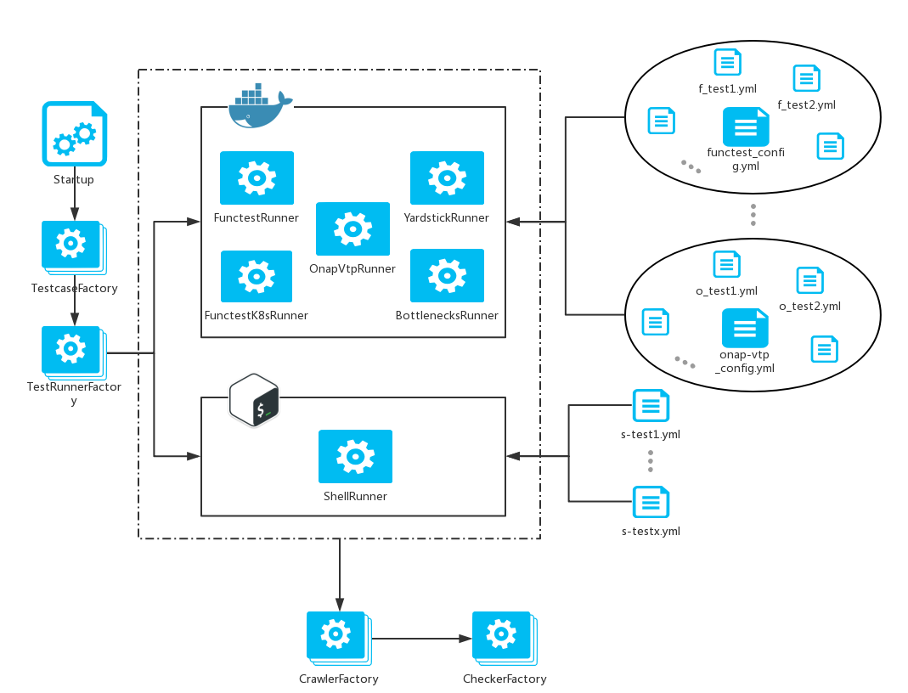

.. This work is licensed under a Creative Commons Attribution 4.0 International License.
.. http://creativecommons.org/licenses/by/4.0
.. (c) Huawei Technologies Co.,Ltd, and others

====================================
Dovetail as a Generic Test Framework
====================================

.. toctree::
   :maxdepth: 2

Overview
========

Dovetail is responsible for the technical realization of the OPNFV Verified
Program (OVP) and other compliance verification projects within the scope of
the Linux Foundation Networking (LFN) umbrella project.
Dovetail provides a generic framework for executing a specific set of test cases
which define the scope of a given compliance verification program, such as OVP.

This document aims at introducing what Dovetail generic framework looks like and
how to develop within this framework.

Introduction of Dovetail Framework
==================================

The following diagram illustrates Dovetail generic framework.

Development with Dovetail Framework
===================================

For everyone who wants to do some developments with Dovetail framework to integrate
new upstream test cases, they will face the following 2 situations:

- **Adding test cases that belong to integrated projects**: There are already some
  projects integrated in Dovetail. The projects are coming from OPNFV (Open Platform
  for NFV) and ONAP (Open Network Automation Platform) communities. It will be
  much easier to add new test cases that belong to these projects.

- **Adding test cases that not belong to integrated projects**: The test cases
  may belong to other projects that haven't been integrated into Dovetail yet.
  The projects could be in OPNFV, ONAP or other communities. For this situation,
  it is a little more complicated than the first one.

Test cases belonging to integrated projects
-------------------------------------------

Dovetail framework already includes a large amount of test cases. All these test
cases are implemented by upstream projects in OPNFV and ONAP. The upstream
projects already integrated in Dovetail are FuncTest, Yardstick and Bottlenecks
from OPNFV and VNF SDK from ONAP.

If you want to add one new test case belonging to one of these projects, there
only need to add one test case configuration file which is in yaml format.
Following is the introduction about how to use the file to add one new test case.
Please refer to `Dovetail test case github
<https://github.com/opnfv/dovetail/tree/master/etc/testcase>`_
for all configuration files of all test cases.

.. code-block:: bash

   ---
   Test case name in Dovetail:
     name: Test case name in Dovetail
     objective: Test case description
     validate:
       type: 'shell' or name of the project already integrated in Dovetail
       testcase: The test case name called in this project
       image_name: Name of the Docker image used to run this test
       pre_condition:
         - 'Commands needed to be executed before running this test'
         - 'e.g. cp src_file dest_file'
       pre_copy:
         src_file: sub_testcase_list.txt
         exist_src_file: Name of existing test case config file
         dest_path: /path/to/put/the/sub/test/list/
       cmds:
         - 'Commands used to run this test case'
       post_condition:
         - 'Commands needed to be executed after running this test case'
     report:
       source_archive_files:
         - test.log
       dest_archive_files:
         - path/to/archive/test.log
       check_results_file: results.json
       sub_testcase_list:
         - sub_test_1
         - sub_test_2
         - sub_test_3

This is the complete format of test case configuration file. Here gives some
further explanation.

- **Test case name in Dovetail**: All test cases should be named as 'xxx.yyy.zzz'.
  This is the name in Dovetail and has no relationship with its name in its own
  project. The first part is used to identify the project where this test case
  come from (e.g. functest, onap-vtp). The second part is used to classify this
  test case according to test area (e.g. healthcheck, ha). Dovetail supports to
  run whole test cases in one test suite with the same test area. Also the area
  is used to group all test cases and generate the summary report at the end of
  the test. The last part is special for this test case itself (e.g. image,
  haproxy, csar). It's better to keep the file name the same as the test case
  name to make it easier to find the config file according to this test case
  name in Dovetail.

- **validate**: This is the main section to define how to run this test case.

  - **type**: This is the type of this test case. It can be `shell` which means
    running this test case with Linux commands within Dovetail container. Also it
    can be one of the projects already integrated in Dovetail (functest, yardstick,
    bottlenecks and onap-vtp). Then this type is used to map to its project
    configuration yaml file. For example, if you are planning to add a test case
    in OPNFV project FuncTest to Dovetail framework, the type here should be
    `functest`, and will map to `functest_config.yml` for more configurations
    in project level. Please refer to `Dovetail project config github
    <https://github.com/opnfv/dovetail/tree/master/etc/conf>`_ for more details.

  - **testcase**: This is the name defined in its own project. One test case can
    be uniquely identified by `type` and `testcase`. Take the test case
    `functest.vping.ssh` as an example. Its name in Dovetail is `functest.vping.ssh`,
    its type is `functest` and its name in FuncTest is `vping_ssh`. Users only
    need to know that there is a test case named `functest.vping.ssh` in OVP
    compliance test scope. Dovetail Framework will run `vping_ssh` within FuncTest
    Docker container.

  - **image_name**: [optional] If the type is `shell`, there is no need to give
    this. For other types, there are default docker images defined in their project
    configuration files. If this test case uses a different docker image, it needs
    to overwrite it by adding `image_name` here. The `image_name` here should only
    be the docker name without tag. The tag is defined in project's configuration
    file for all test cases belonging to this project.

  - **pre_condition**: [optional] It's a list of all preparations needed by this
    test case. If the list is the same as the default one in its project configuration
    file, then there is no need to repeat it here. Otherwise, it's necessary to
    overwrite it. If its type is `shell`, then all commands in `pre_condition`,
    `cmds` and `post_condition` should be executable within Dovetail Ubuntu 14.04
    Docker container. If its type is one of the Docker runner projects, then all
    commands should be executable within their own containers. For FuncTest, it's
    alpine 3.8. For Yardstick and Bottlenecks, it's Ubuntu 16.04. Also all these
    commands should not require network connection because some commercial platforms
    may be offline environment in private labs.

  - **pre_copy**: [optional] It's only required when `testcase` is `bgpvpn` or
    `tempest_custom` with `functest`. For `tempest_custom`, it will generate a
    test case list according to `sub_testcase_list` and copy it to functest container.
    For `bgpvpn`, it will replace the test case defined in FuncTest with the existing
    file in Dovetail repo. Currently, this is not very general and still need some
    optimization.

        - **src_file**: [optional] If it's `tempest_custom`, it should provide
          file name of the generated test case list here. The file name should
          satisfy the requirements `tempest_custom` itself.

        - **exist_src_file**: [optional] If it's `bgpvpn`, it should provide
          name of the existing file in Dovetail repo.

        - **dest_path**: This is the path where should put the file in FuncTest
          container. Also the path should satisfy the requirements of project
          FuncTest itself.

  - **cmds**: [optional] It's a list of all commands used to run this test case.

  - **post_condition**: [optional] It's a list of all commands needed after executing
    this test case such as some clean up operations.

- **report**: This is the section for this test case to archive some log files and
  provide the result file for reporting PASS or FAIL.

  - **source_archive_files**: [optional] If there is no need to archive any files,
    you can remove this section. Otherwise, this is a list of all source files
    needed to be archived. All files generated by all integrated projects will be
    put under `$DOVETAIL_HOME/results`. In order to classify and avoid overwriting
    them, it needs to rename some important files or move them to new directories.
    You can navigate directory `$DOVETAIL_HOME/results` to find out all files
    you plan to archive. The paths here should be relative ones according to
    `$DOVETAIL_HOME/results`.

  - **dest_archive_files**: [optional] This should be a list corresponding to the
    list of `source_archive_files`. Also all paths here should be relative ones
    according to `$DOVETAIL_HOME/results`.

  - **check_results_file**: This shoule be the name and relative path of the result
    file generated by this test case. Dovetail will parse this file to get the
    result (PASS or FAIL).

  - **sub_testcase_list**: [optional] This section is almost only for Tempest tests
    in FuncTest. Take `functest.tempest.osinterop` as an example. The `sub_testcase_list`
    here is an check list for this kind of tempest tests. Only when all sub test
    cases list here are passed, this test case can be taken as PASS. The other kind
    of tempest tests is `tempest_custom` such as `functest.tempest.image`. Besides
    taking the `sub_testcase_list` as the check list, it's also used to generate an
    input file of FuncTest to define the list of sub test cases to be test.

Test cases not belonging to integrated projects
-----------------------------------------------

If the test cases you are planning to add to Dovetail don't belong to any project
that is already integrated into Dovetail framework, then besides adding the test
case configuration files introduced before, there are some other files needed to
be modified.

Step 1: Add a project configuration file
^^^^^^^^^^^^^^^^^^^^^^^^^^^^^^^^^^^^^^^^

For a new test case that belongs to a new project, it needs to create a project
configuration file to define this new project in Dovetail first. Now Dovetail
only supports to integrate projects by using their Docker images. If you design
to run this test case with shell runner, then can only add test case configuration
files with `type` 'shell' as describing before and skip this Step 1. Following is
the introduction of how to use project configuration file to add one new project
into Dovetail. Please refer to `Dovetail projects configuration github
<https://github.com/opnfv/dovetail/tree/master/etc/conf>`_ for all configuration
files of all integrated projects.

.. code-block:: bash

   ---
   
   
   
   
   
   
   
   
   
   project name:
     image_name: name of the docker image
     docker_tag: tag of the docker image
     opts: options needed such as '-itd'
     envs: envs used to create containers such as '-e DEBUG={{debug}}'
     volumes:
       - '-v {{dovetail_home}}/results:{{result_dir}}'
       - '-v {{dovetail_home}}:{{config_dir}}'
     config:
       dir: {{config_dir}}
     pre_condition:
       - 'Commands needed to be executed before running this test'
     cmds:
       - 'Commands used to run this test case'
     post_condition:
       - 'Commands needed to be executed after running this test case'
     result:
       dir: {{result_dir}}
     openrc: absolute path of openstack credential files
     extra_container:
       - container1_name
       - container2_name

This is the complete format of project configuration file. Here gives some
further explanation.

- **Jinja Template**: At the begining of this yaml file, it uses Jinja template
  to define some parameters that will be used somewhere in this file (e.g. result_dir).
  Also there are some parameters providing by Dovetail framework as input of this
  file, and you can define other parameters by using these ones (e.g. testcase and
  dovetail_home). The whole input parameters are list below.

    - **validate_testcase**: This is the name of the test case which calls this
      project configuration file. The name is provided by the configuration file
      this test case (validate -> testcase).

    - **testcase**: This is the name of the test case which calls this project
      configuration file. Different from `validate_testcase`, this is the name
      defined in Dovetail not its own project.

    - **os_insecure**: This is only for test cases aiming at OpenStack. This is
      `True` or `False` according to `env_config.sh` file.

    - **cacert**: This is also only for OpenStack test cases. It is the absolute
      path of the OpenStack certificate provided in `env_config.sh` file.

    - **deploy_scenario**: This is the input when running Dovetail with option
      `--deploy-scenario`.

    - **dovetail_home**: This is the `DOVETAIL_HOME` getting from the ENV.

    - **debug**: This is `True` or `False` according to the command running test
      cases with or without option `--debug`.

    - **build_tag**: This is a string includes the UUID generated by Dovetail.

    - **host_url**: This is only for ONAP VNF SDK to get the HOST_URL provided
      in `env_config.sh` file.

    - **csar_file**: This is also only for ONAP VNF SDK to get the CSAR_FILE
      provided in `env_config.sh` file.

- **project name**: This is the project name defined in Dovetail. For example
  OPNFV FuncTest project is named as 'functest' here in Dovetail. This project
  name will be used by test case configuration files as well as somewhere in
  Dovetail source code.

- **image_name**: This is the name of the default Docker image for all test cases
  within this project. Each test case can overwrite it with its own configuration.

- **docker_tag**: This is the tag of all Docker images for all test cases within
  this project. For each release version, it should use a stable and official
  release version Docker image.

- **opts**: Here are all options used to run Docker containers except envs and
  volume mapping (e.g. '-it --privileged=true').

- **envs**: Here are all envs used to run Docker containers (e.g. '-e ONE=one
  -e TWO=two').

- **volumes**: This is a volume mapping list used to run Docker containers. You
  should at least map the result volume in containers to `$DOVETAIL_HOME/results`
  in the test host to collect all result files.

- **config dir**: Plan to remove this.

- **pre_condition**: It's a list of all default preparations needed by this project.
  It can be overwritten by configurations of test cases.

- **cmds**: It's a list of all default commands used to run all test cases within
  this project. Also it can be overwritten by configurations of test cases. 

- **post_condition**: It's a list of all default cleaning commands needed by this
  project.

- **result dir**: Plan to remove this.

- **openrc**: [optional] If the system under test is OpenStack, then it needs to
  provide the absolute path here to copy the credential file in the test host to
  containers.

Step 2: Add related classes
^^^^^^^^^^^^^^^^^^^^^^^^^^^

After adding the project and test case configuration files, there also need to
add some related classes into the source code.

- **Test Case class**: Each project should have its own test case class in
  `testcase.py` for `TestcaseFactory`.

- **Test Runner class**: Each project should have its own test runner class in
  `test_runner.py` for `TestRunnerFactory`.

- **Crawler class**: Each project should have its own test results crawler class
  in `report.py` for `CrawlerFactory`.

- **Checker class**: Each project should have its own test results checker class
  in `report.py` for `CheckerFactory`.

Step 3: Create related logs
^^^^^^^^^^^^^^^^^^^^^^^^^^^

If the classes you add in step2 have function `create_log`, then need to call
these functions in `run.py` to initial the log instances at the very begining.

