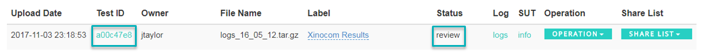
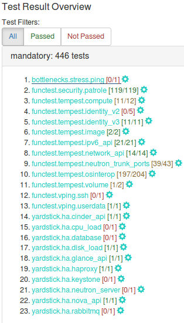
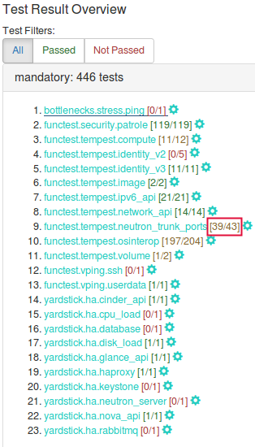
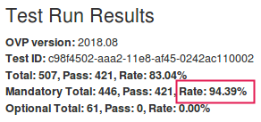
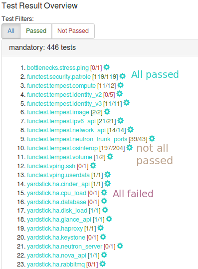
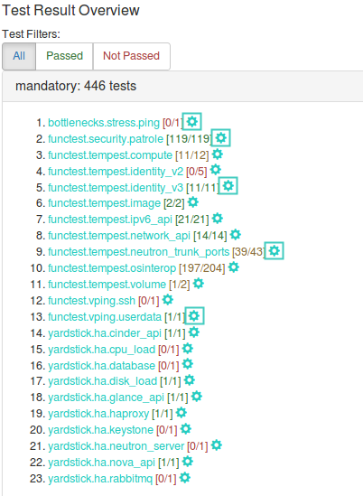
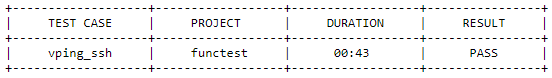
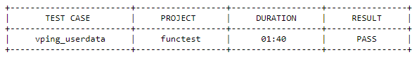
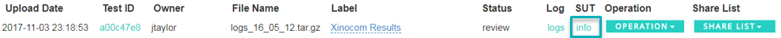
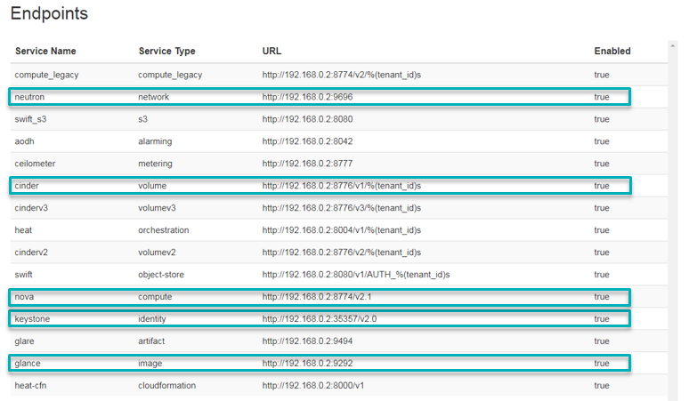

.. This work is licensed under a Creative Commons Attribution 4.0 International License.
.. http://creativecommons.org/licenses/by/4.0
.. (c) Ericsson AB

=============================================
OPNFV Verified Program 2018.08 Reviewer Guide
=============================================

.. toctree::
   :maxdepth: 2

Introduction
============

This reviewer guide provides detailed guidance for reviewers on how to handle the result review
process.

The OPNFV Verified program provides the ability for users to upload test results in
`OVP portal <https://verified.opnfv.org>`_ and request from OPV community for review.
After the user submit for review the test results **Status** is changed from 'private' to 'review' (as shown in figure
2).

OVP administrator will ask for review volunteers using the verified@opnfv.org email alias.
The incoming results for review will be identified by the administrator with particular **Test ID**
and **Owner** values.

Volunteers that will accept the review request can access the test results by login to the `OVP portal <https://verified.opnfv.org>`_
and the click on the **My Results** tab in top-level navigation bar.

Figure 1

The corresponding OVP portal result will have a status of ‘review’.

Figure 2

Reviewers must follow the checklist below to ensure review consistency for the OPNFV
Verified Program (OVP) 2018.08 (Fraser) release at a minimum.

#. **Mandatory Test Area Results** - Validate that results for all mandatory test areas are present.
#. **Test-Case Count within Mandatory Test Area** - Check that the total number of test-cases are present in each mandatory test area.
#. **Test-Case Pass Percentage** - Ensure all tests have passed (100% pass rate).
#. **Log File Verification** - Inspect the log file for each test area.
#. **SUT Info Verification** - Validate the system under test (SUT) hardware and software endpoint info is present.

1. Mandatory Test Area Results
==============================

Test results can be displayed by clicking on the hyperlink under the 'Test ID' column.
User should validate that results for all mandatory test areas are included in the overall test suite. The required
mandatory test areas are:

- **bottlenecks**
- **functest**
- **yardstick**

*Note, that the 'Test ID' column in this view condenses the UUID used for 'Test ID' to
eight characters even though the 'Test ID' is a longer UUID in the back-end.*

Figure 3

2. Test-Case Count within Mandatory Test Area
=============================================

Validate the test-case count within each test area. For the OVP 2018.08 release, this must break
down as outlined in the table below.

+-------------------------+---------------------+
| **Mandatory Test Area** | **Test-Case Count** |
+-------------------------+---------------------+
| bottlenecks             | 1                   |
+-------------------------+---------------------+
| functest                | 427                 |
+-------------------------+---------------------+
| yardstick               | 15                  |
+-------------------------+---------------------+
| **Total**               | **443**             |
+-------------------------+---------------------+

The numbers in brackets separated by "/" at the right of each test case is the number of pass/total tests.

The figure below depicts an example that should flag a negative review. The mandatory
functest.tempest.neutron_trunk_ports [39/43] test area states that total number of test cases are 43 but in fact
there are 40.

Figure 4

3. Test-Case Pass Percentage
============================

All mandatory test-cases have to run successfuly. The below diagram of the 'Test Run Results' is one method and
shows that 94.39% of the mandatory test-cases have passed.
This value must not be lower than 100%.

Figure 5

Failed test cases can also be easy identified by the color of pass/total number. :

- Green when all test-cases pass
- Orange when at least one fails
- Red when all test-cases fail

Figure 6

4. Log File Verification
========================

Each log file of the three mandatory test areas has to be verified.

Log files can be displayed by clicking on the setup icon to the right of the results,
as shown in figure below.

Figure 7

*Note, all log files can be found at results/ directory as shown at the following table.*

+------------------------+--------------------------+
| **Mandatory Test Area**| **Location**             |
+------------------------+--------------------------+
| bottlenecks            | results/stress_logs/     |
+------------------------+--------------------------+
| functest.tempest       | results/tempest_logs/    |
+------------------------+--------------------------+
| functest.security      | results/security_logs/   |
+------------------------+--------------------------+
| yardstick              | results/ha_logs/         |
+------------------------+--------------------------+

The dottlenecks log must contain the 'SUCCESS' result as shown in following example:

  2018-08-28 10:41:18,482 [ERROR] yardstick.benchmark.core.task task.py:132 Testcase: "ping_bottlenecks" **SUCCESS**!!!

Functest logs opens an html page that lists all test cases as shown in figure 8. All test cases must have run
successfuly.

.. image:: fraser/images/ovp_log_functest_image.png
    :align: center
    :scale: 100%

Figure 8

For the vping test area log file (functest.log). The two entries displayed in the tables below must be present in
this log file.

**functest.vping_userdata**

Figure 9

**functest.vping_ssh**

Figure 10

The yardstick log  must contain the 'SUCCESS' result for each of the test-cases within this
test area. This can be verified by searching the log for the keyword 'SUCCESS'.

An example of a FAILED and a SUCCESS test case are listed below:

 2018-08-28 10:25:09,946 [ERROR] yardstick.benchmark.scenarios.availability.monitor.monitor_multi monitor_multi.py:78 SLA **failure**: 14.015082 > 5.000000

 2018-08-28 10:23:41,907 [INFO] yardstick.benchmark.core.task task.py:127 Testcase: "opnfv_yardstick_tc052" **SUCCESS**!!!

5. SUT Info Verification
========================

SUT information must be present in the results to validate that all required endpoint services
and at least two controllers were present during test execution. For the results shown below,
click the '**info**' hyperlink in the **SUT** column to navigate to the SUT information page.

Figure 11

In the '**Endpoints**' listing shown below for the SUT VIM component, ensure that services are
present for identify, compute, image, volume and network at a minimum by inspecting the
'**Service Type**' column.

Figure 12

Inspect the '**Hosts**' listing found below the Endpoints secion of the SUT info page and ensure
at least two hosts are present, as two controllers are required the for the mandatory HA
test-cases.
