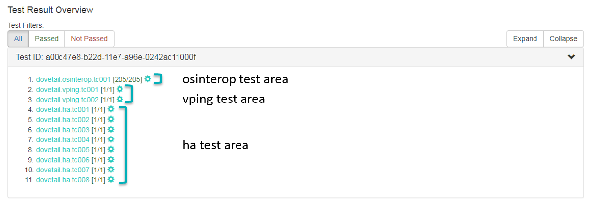
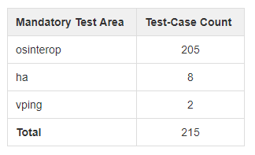
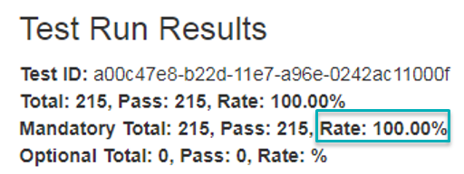
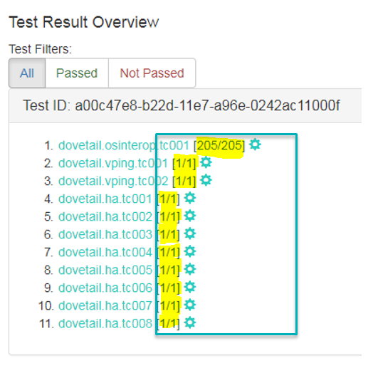
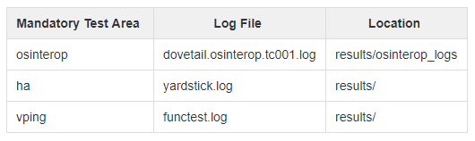
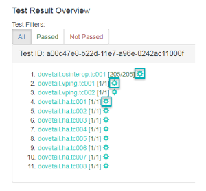
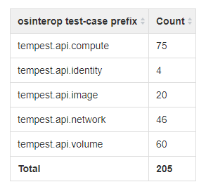

.. This work is licensed under a Creative Commons Attribution 4.0 International License.
.. http://creativecommons.org/licenses/by/4.0
.. (c) Ericsson AB

=============================================
OPNFV Verified Program 2018.01 Reviewer Guide
=============================================

.. toctree::
   :maxdepth: 2

Introduction
============

This reviewer guide provides detailed guidance for reviewers on how to handle the result review
process. Reviewers must follow the checklist below to ensure review consistency for the OPNFV
Verified Program (OVP) 2018.01 (Danube) release at a minimum.

#. **Mandatory Test Area Results** - Validate that results for all mandatory test areas are
present.
#. **Test-Case Count within Mandatory Test Area** - Check that the total number of test-cases
are present in each mandatory test area.
#. **Test-Case Pass Percentage** - Ensure all tests have passed (100% pass rate).
#. **Log File Verification** - Inspect the log file for each test area (osinterop, ha, vping).
#. **SUT Info Verification** - Validate the system under test (SUT) hardware and software endpoint
info is present.

1. Mandatory Test Area Results
==============================

Validate that results for all mandatory test areas are included in the overall test suite. The
required mandatory test areas are:
 - **osinterop**
 - **vping**
 - **ha**

Login to the OVP portal at:

*https://verified.opnfv.org*

Click on the 'My Results' tab in top-level navigation bar.

The OVP administrator will ask for review volunteers using the verified@opnfv.org email alias. The
incoming results for review will be identified by the administrator with particular 'Test ID'
and 'Owner' values. The corresponding OVP portal result will have a status of 'review'.

In the example above, this information will be provided as:
- Test ID: a00c47e8
- Owner: jtaylor

Click on the hyperlink within the 'Test ID' column.

*Note, that the 'Test ID' column in this view condenses the UUID used for 'Test ID' to
eight characters even though the 'Test ID' is a longer UUID in the back-end.*

The 'Test ID' hyperlink toggles the view to a top-level listing of the results displayed above.
Validate that osinterop, vping and ha test area results are all present within the view.

2. Test-Case Count within Mandatory Test Area
=============================================

Validate the test-case count within each test area. For the OVP 2018.01 release, this must break
down as outlined in the table below.

In the diagram above (from section 1), these counts can be gleaned from the numbers to the
right of the test-cases. The total number is given for the osinterop (dovetail.osinterop.tc001)
test area at 205. The vping (dovetail.vping.tc00x) and ha (dovetail.ha.tc00x) test-cases are
broken down separately with a line for each test-case. Directly above the 'Test Result Overview'
listing there's a summary labelled 'Test Run Results' shown below. For OVP 2018.01, a mandatory
total of **215** test-cases must be present (205 osinterop + 8 ha + 2 vping).

.. image:: danube/images/ovp_missing_ha.png
    :align: center
    :scale: 100%

An example of a listing that should flag a negative review is shown above. The mandatory ha test
area is missing one test case (dovetail.ha.tc008).

3. Test-Case Pass Percentage
============================

All mandatory test-cases must pass. This can be validated in multiple ways. The below diagram of
the 'Test Run Results' is one method and shows that 100% of the mandatory test-cases have passed.
This value must not be lower than 100%.

Another method to check that all mandatory test-cases have passed is shown in the diagram below.
The pass/total is given as a fraction and highlighted here in yellow. For the osinterop test area,
the result must display [205/205] and for each of the test-cases under the vping and ha test areas
[1/1] must be displayed.

4. Log File Verification
========================

Three log files must be verified for content within each mandatory test area. The log files for
each of the test areas is noted in the table below.

The three log files can be displayed by clicking on the setup icon to the right of the results,
as shown in the diagram below.

*Note, while the vping and ha test areas list multiple test-cases in the below diagram, there is
a single log file for all test-cases within these test areas.*

Within the osinterop log (dovetail.osinterop.tc001.log), scroll down to the area of the log that
begins to list the results of each test-case executed. This can be located by looking for lines
prefaced with '**tempest.api**' and ending with '**... ok**'.

The number of lines within the osinterop log for test-cases must add up according to the table
above, where test-cases are broken down according to compute, identity, image, network and volume,
with respective counts given in the table. The ha log (yardstick.log) must contain the 'PASS'
result for each of the eight test-cases within this test area. This can be verified by searching
the log for the keyword 'PASS'.

The eight lines to validate are listed below:

 - 017-10-16 05:07:49,158 yardstick.benchmark.scenarios.availability.serviceha serviceha.py:81
   INFO The HA test case PASS the SLA
 - 2017-10-16 05:08:31,387 yardstick.benchmark.scenarios.availability.serviceha serviceha.py:81
   INFO The HA test case PASS the SLA
 - 2017-10-16 05:09:13,669 yardstick.benchmark.scenarios.availability.serviceha serviceha.py:81
   INFO The HA test case PASS the SLA
 - 2017-10-16 05:09:55,967 yardstick.benchmark.scenarios.availability.serviceha serviceha.py:81
   INFO The HA test case PASS the SLA
 - 2017-10-16 05:10:38,407 yardstick.benchmark.scenarios.availability.serviceha serviceha.py:81
   INFO The HA test case PASS the SLA
 - 2017-10-16 05:11:00,030 yardstick.benchmark.scenarios.availability.scenario_general
   scenario_general.py:71 INFO [92m Congratulations, the HA test case PASS! [0m
 - 2017-10-16 05:11:22,536 yardstick.benchmark.scenarios.availability.scenario_general
   scenario_general.py:71 INFO [92m Congratulations, the HA test case PASS! [0m
 - 2017-10-16 05:12:07,880 yardstick.benchmark.scenarios.availability.scenario_general
   scenario_general.py:71 INFO [92m Congratulations, the HA test case PASS! [0m

The final validation is for the vping test area log file (functest.log). The two entries
displayed in the diagrams below must be present in this log file.

 - vping_userdata
 - vping_ssh

.. image:: danube/images/ovp_vping_user.png
    :align: center
    :scale: 100%

.. image:: danube/images/ovp_vping_ssh.png
    :align: center
    :scale: 100%

5. SUT Info Verification
========================

SUT information must be present in the results to validate that all required endpoint services
and at least two controllers were present during test execution. For the results shown below,
click the '**info**' hyperlink in the **SUT** column to navigate to the SUT information page.

In the '**Endpoints**' listing shown below for the SUT VIM component, ensure that services are
present for identify, compute, image, volume and network at a minimum by inspecting the
'**Service Type**' column.

.. image:: danube/images/sut_endpoints.png
    :align: center
    :scale: 100%

Inspect the '**Hosts**' listing found below the Endpoints secion of the SUT info page and ensure
at least two hosts are present, as two controllers are required the for the mandatory HA
test-cases.
