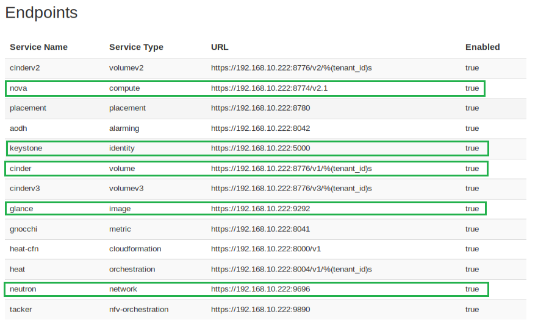

.. This work is licensed under a Creative Commons Attribution 4.0 International License.
.. http://creativecommons.org/licenses/by/4.0
.. (c) Ericsson AB

==================
OVP Reviewer Guide
==================

.. toctree::
   :maxdepth: 2

Introduction
============

This document provides detailed guidance for reviewers on how to handle the result review
process.

The OPNFV Verification Program (OVP) provides the ability for users to upload test results in
`OVP portal <https://nfvi-verified.lfnetworking.org>`_ and request from OVP community to review them.

OVP administrator will ask for review volunteers using the ovp-support@lfnetworking.org email alias.
The incoming results for review will be identified by the administrator with particular **Test ID**
and **Owner** values.

Volunteers that will accept the review request can access the test results by login to the
`OVP portal <https://nfvi-verified.lfnetworking.org>`_ and then click on the **Incoming Reviews**
tab in top-level navigation bar.

.. image:: images/ovp_top_nav.png
    :align: center
    :scale: 100%

After the user submit for review the test results **Status** is changed from 'private' to 'review'.
Reviewers can find that the corresponding OVP portal result will have a status of 'review'.
Also there are **Application** information list here for review. All the application information
is submitted by users at the same time they submit their results for review. Reviewers can also
find who has already approve/not approve the test results by clicking on the **View Reviews**.

.. image:: images/ovp_result_review.png
    :align: center
    :scale: 100%

Reviewers must follow the checklist below to ensure review consistency for the OPNFV
Verification Program (OVP) 2019.12 (Hunter) release at a minimum.

#. **Test Case Pass Percentage** - Ensure all mandatory tests have passed (100% pass rate).
#. **Mandatory Test Case Results** - Validate that results for all mandatory test cases are present.
#. **Log File Verification** - Inspect the log file for each test case.
#. **SUT Info Verification** - Validate the system under test (SUT) hardware and software endpoint info is present.

Test Case Pass Percentage
=========================

All mandatory test cases have to run successfully. The below figure of the **Test Run Results**
is one method and shows that 96.71% of the mandatory test cases have passed.
This value must not be lower than 100%.

.. image:: images/ovp_pass_percentage.png
    :align: center
    :width: 350 px

Mandatory Test Case Results
===========================

Test results can be displayed by clicking on the hyperlink under the **Test ID** column.
Reviewers should validate that results for all mandatory test cases are included in the overall
test suite. The required mandatory test cases are:

- bottlenecks.stress.ping
- functest.security.patrole
- functest.tempest.compute
- functest.tempest.identity_v3
- functest.tempest.image
- functest.tempest.ipv6_api
- functest.tempest.network_api
- functest.tempest.neutron_trunk_ports
- functest.tempest.osinterop
- functest.tempest.volume
- functest.vping.ssh
- functest.vping.userdata
- yardstick.ha.cinder_api
- yardstick.ha.cpu_load
- yardstick.ha.database
- yardstick.ha.disk_load
- yardstick.ha.glance_api
- yardstick.ha.haproxy
- yardstick.ha.keystone
- yardstick.ha.neutron_server
- yardstick.ha.nova_api
- yardstick.ha.rabbitmq

*Note, that the 'Test ID' column in this view condenses the UUID used for 'Test ID' to
eight characters even though the 'Test ID' is a longer UUID in the back-end.*

Failed test cases can be easy identified by the color of pass/total number:

- **Green** when all test cases pass
- **Orange** when at least one fails/skips
- **Red** when all test cases fail/skip

.. image:: images/ovp_pass_fraction.png
    :align: center
    :width: 350 px

Log File Verification
=====================

Each log file of the mandatory test cases have to be verified for content.

Log files can be displayed by clicking on the setup icon to the right of the results,
as shown in the figure below.

*Note, all log files can be found at results/ directory as shown at the following table.*

+------------------------+--------------------------+
| **Mandatory Test Case**| **Location**             |
+------------------------+--------------------------+
| bottlenecks            | results/stress_logs/     |
+------------------------+--------------------------+
| functest.vping         | results/vping_logs/      |
+------------------------+--------------------------+
| functest.tempest       | results/tempest_logs/    |
+------------------------+--------------------------+
| functest.security      | results/security_logs/   |
+------------------------+--------------------------+
| yardstick              | results/ha_logs/         |
+------------------------+--------------------------+

Bottlenecks Logs
----------------

It must contain the 'SUCCESS' result at the end of Bottlenecks log as shown in following example:

  2019-12-03 07:35:14,630 [INFO] yardstick.benchmark.core.task task.py:129 Testcase: "ping_bottlenecks" SUCCESS!!!

Functest Logs
-------------

There are 2 different types of Functest logs, one is plain text for **vping** test cases and the other
is html file for **tempest** and **security** test cases.

For **vping** test cases, two entries displayed in the tables below must be present in log files.

**functest.vping.ssh**

.. image:: images/ovp_vping_ssh.png
    :align: center
    :scale: 100%

**functest.vping.userdata**

.. image:: images/ovp_vping_user.png
    :align: center
    :scale: 100%

For **tempest** and **security** test cases, it opens an html page that lists all test cases as shown
below. All test cases must have run successfully.

.. image:: images/ovp_log_files_functest_image.png
    :align: center
    :scale: 100%

Yardstick Logs
--------------

The yardstick log must contain the 'SUCCESS' result for each of the test-cases within this
test area. This can be verified by searching the log for the keyword 'SUCCESS'.

An example of a FAILED and a SUCCESS test case are listed below:

 2018-08-28 10:25:09,946 [ERROR] yardstick.benchmark.scenarios.availability.monitor.monitor_multi monitor_multi.py:78 SLA **failure**: 14.015082 > 5.000000

 2018-08-28 10:23:41,907 [INFO] yardstick.benchmark.core.task task.py:127 Testcase: "opnfv_yardstick_tc052" **SUCCESS**!!!

SUT Info Verification
=====================

SUT information must be present in the results to validate that all required endpoint services
and at least two controllers were present during test execution. For the results shown below,
click the **info** hyperlink in the **SUT** column to navigate to the SUT information page.

.. image:: images/sut_info.png
    :align: center
    :scale: 100%

In the **Endpoints** listing shown below for the SUT VIM component, ensure that services are
present for identify, compute, image, volume and network at a minimum by inspecting the
**Service Type** column.

Inspect the **Hosts** listing found below the Endpoints secion of the SUT info page and ensure
at least two hosts are present, as two controllers are required the for the mandatory HA
test cases.

Approve or Not Approve Results
==============================

When you decide to approve or not approve this test, you can click the **Operation** and choose
**approve** or **not approve**. Once you have approved or not approved the test, you can click
**View Reviews** to find the review status as shown below.

