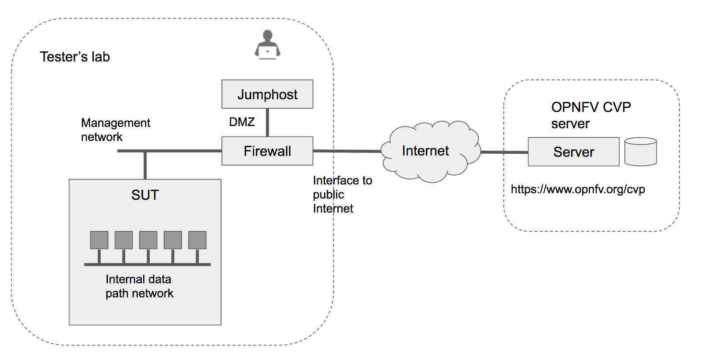
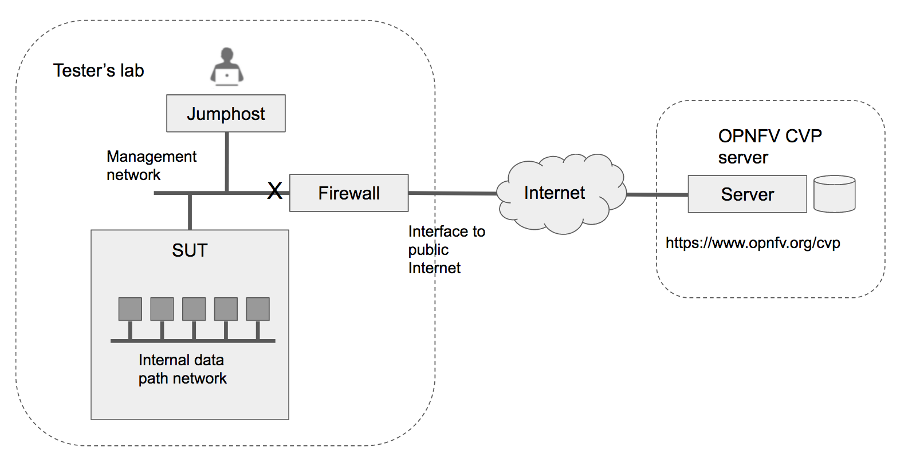

.. This work is licensed under a Creative Commons Attribution 4.0 International License.
.. http://creativecommons.org/licenses/by/4.0
.. (c) OPNFV

==========================================
Conducting CVP Testing using Dovetail
==========================================

Dovetail Testing Overview
------------------------------

The Dvetail testing framework consists of two major parts: the testing client that
executes all test cases in a lab (vendor self-testing or a third party lab),
and the server system that is under the OPNFV's administration to store and
view test results based on a web API. The following diagram illustrates
this overall framework.

Within the tester's lab, the jumphost is the machine where Dovetail executes all
automated test cases. It must be separated from the System Under Test (SUT).
The OPNFV community customarily refers this machine as the jumphost, although
it does not necessarily imply that it serves an intermediary role for secure access.
The above diagram assumes that the tester's jumphost is situated in a DMZ which
has network access to both the SUT and the OPNFV server via the public Internet.
This arrangement may not be practical or convenient in some company's labs for
security reasons. Dovetail also supports an offline mode of testing that is
illustrated in the next diagram.

In the offline mode, the jumphost only needs to have access to the SUT's
API via the internal management network, but not to the public Internet. This
user guide will highlight differences between the online and offline modes of
the jumphost. While it is possible to run the jumphost as a virtual machine,
this user guide assumes it is a physical machine for simplicty. 

Dovetail client tool (or just Dovetail tool or Dovetail for short) can be
installed in the jumphost either directly as a Python script, or as a Docker
container. The Docker container method is simpler and supports both online and
offline modes. If a tester wishes to experiment further with Dovetail or
extend or modify its behavior for testing other than just CVP, then she or he
will need to install Dovetail as Python scripts. This guide will describe both
methods of installation. Once installed, and properly configured, the remaining
test process is mostly identical for the two options. We first go over the
steps of running the test suite. Then, we discuss how to view test
results and make sense of them, for example, what the tester may do in case of
unexpected test failures. Finally, we describe additional Dovetail features
that are not absolutely necessary in CVP testing but users may find useful for
other purposes. One example is to run Dovetail for in-house testing as
preparation before official CVP testing; another example is to run Dovetail
experimental test suites other than the CVP test suite. Experimental tests may
be made available by the community for experimenting less mature test cases or
functionalities for the purpose of getting feedbacks for improvement.

Installing Dovetail
--------------------
Before taking this step, a tester should check the hardware and networking 
requirements of the SUT, and the jumphost in particular, to make sure they are compliant.
In this section, we describe the procedure to install Dovetail client tool on the jumphost. 
The jumphost must have network access to the management network with access rights to
the Virtual Infrastructure Manager's API.

Checking the Jumphost Readiness
^^^^^^^^^^^^^^^^^^^^^^^^^^^^^^^

The OPNFV community has not yet have definitive requirements on a specific operating
system or version, these have been validated by the community through some level of 
exercise in the OPNFV Pharos labs or other vendor systems during OPNFV PlugFests.

- Ubuntu 16.04.2 LTS (Xenial) for x86_64
- Ubuntu 14.04 LTS (Trusty) for x86_64
- CentOS-7-1611 for x86_64
- Red Hat Enterprise Linux 7.3 for x86_64
- Fedora 24 Server for x86_64 
- Fedora 25 Server for x86_64

The readers may also check the Dovetail project's wiki page for an updated list
based on user feedbacks.
 
Non-Linux operating systems, such as Windows, Mac OS, have not been tested at this time.

If online mode is used, the tester should also validate that the jumphost can reach 
the public Internet. For example,
 
.. code-block:: bash
   
   $ ping 8.8.8.8
   $ ping https://www.opnfv.org/cvp

Configuring the Jumphost Environment
^^^^^^^^^^^^^^^^^^^^^^^^^^^^^^^^^^^^^^

The jumphost needs a few environment variables set correctly in order to access the
Openstack API required to drive the Dovetail tests. For convenience and as a convention,
we will also create a home directory:

.. code-block:: bash
   $ cd $HOME
   $ mkdir cvp

At this point, you will need to consult your SUT (Openstack) administrator to correctly set 
the configurations in a file. 
The Openstack settings need to be configured such that the Dovetail client has all the necessary
credentials and privileges to execute all test operations.
In our example, we will use the file $HOME/cvp/env_config.sh.

.. code-block:: bash
   
   $ cat cvp/env_config.sh
   
   # Project-level authentication scope (name or ID), recommend admin project.
   export OS_PROJECT_NAME=admin
   # Authentication username, belongs to the project above, recommend admin user.
   export OS_USERNAME=admin
   # Authentication password. Use your own password
   export OS_PASSWORD=xxxxxxxx
   # Authentication URL, one of the endpoints of keystone service. If this is v3 version,
   # there need some extra variables as follows.
   export OS_AUTH_URL='http://xxx.xxx.xxx.xxx:5000/v3'
   # Default is 2.0. If use keystone v3 API, this should be set as 3.
   export OS_IDENTITY_API_VERSION=3
   # Domain name or ID containing the user above.
   # Command to check the domain: openstack user show <OS_USERNAME>
   export OS_USER_DOMAIN_NAME=default
   # Domain name or ID containing the project above.
   # Command to check the domain: openstack project show <OS_PROJECT_NAME>
   export OS_PROJECT_DOMAIN_NAME=default
   # Home directory for dovetail
   export DOVETAIL_HOME=$HOME/cvp

Export all these variables into environment by,

.. code-block: bash
      
   $ sudo source $HOME/cvp/env_config.sh

You can validate that the Openstack environmental settings are correct by,

.. code-block:: bash
   $ openstack service list

Installing Prerequisite on the Jumphost
^^^^^^^^^^^^^^^^^^^^^^^^^^^^^^^^^^^^^^^^^^^

The main prerequisite software for Dovetail are Python and Docker. Note that regardless of
whether Dovetail is run as a container or as Python scripts, Docker is always required.

In the current release (Danube), Dovetail requires Python 2.7 or later.

Use the following steps to check if the right version of python is already installed, 
and if not, install it.

.. code-block:: bash

   $ python --version
   $ echo "Please add Python installation or upgrade steps"

Dovetail also requires Docker 1.12.3 or later. Use the following step to check if 
the right version of Docker is already installed, and if not, install it.

.. code-block:: bash

   $ docker --version
    
The Docker installation process can be more complex, you should refer to the official
Docker installation guide that is relevant to your environment.

The following simple script will install the latest version of Docker. If you do not intend 
to upgrade your system's Docker version, you should not use this simple method.

.. code-block:: bash

   $ wget -qO- https://get.docker.com/ | sh

The above installation steps assume that the jumphost is in the online mode. For offline
testing, use the following offline installation steps instead.

In order to install or upgrade Python offline,

.. code-block:: bash

   $ echo "Please add offline python installation or upgrade"

In order to install Docker offline, download Docker static binaries and copy the
tar file to the jumphost, then you may follow these instructions to install.

.. code-block:: bash

   $ tar /path/to/the-file.tar.gz

Copy the executables to a directory on $PATH, for example, /usr/bin/.

.. code-block:: bash

   $ sudo cp docker/* /usr/bin/
   
Start the Docker daemon.

.. code-block:: bash

   $ sudo dockerd &

Installing Dovetail on the Jumphost
^^^^^^^^^^^^^^^^^^^^^^^^^^^^^^^^^^^^

The Dovetail project maintains a Docker image that has Dovetail test tools preinstalled.
This Docker image is tagged with versions. Before pulling the Dovetail image, check the
OPNFV's CVP web page first to determine the right tag for CVP testing.

If the jumphost is online, you can directly pull.

.. code-block:: bash

   $ sudo docker pull opnfv/dovetail:<tag>

An example of the <tag> is *latest*.

If the jumphost is offline, you will need to first pull the Dovetail Docker image, and all the
dependent images that Dovetail uses, to a host that is online. The reason that you need
to pull all depdent images is because Dovetail normally does dependency checking at run-time
and automatically pull images as needed, if the jumphost is online. If the jumphost is
offline, then all these dependencies will also need to be manually copied.

.. code-block:: bash

   $ sudo docker pull opnfv/dovetail:<tag>
   $ sudo docker pull opnfv/functest:<tag>
   $ sudo docker pull opnfv/yardstick:<tag>

Once all these images are pulled, save the images, copy to the jumphost, and then load 
the Dovetail and all dependent images at the jumphost.

At the online host, save images.

.. code-block:: bash
   
   $ sudo docker save -o dovetail.tar opnfv/dovetail:<tag> opnfv/functest:<tag> opnfv/yardstick:<tag>

Copy dovetail.tar file to the jumphost, and then load the images on the jumphost.

.. code-block:: bash

   $ sudo docker load --input dovetail.tar

Now check to see that the Dovetail image has been pulled or loaded properly.

.. code-block:: bash

   $ sudo docker images
   REPOSITORY          TAG                 IMAGE ID            CREATED             SIZE
   opnfv/functest      latest              9eaeaea5f203        8 days ago          1.53GB
   opnfv/dovetail      latest              5d25b289451c        8 days ago          516MB
   opnfv/yardstick     latest              574596b6ea12        8 days ago          1.2GB

Regardless of whether you pulled down the Dovetail image directly online, or loaded from
a static image tar file, you are ready to run Dovetail.

.. code-block:: bash

   $ sudo docker run --privileged=true -it \
             -v $DOVETAIL_HOME/env_config.sh:$DOVETAIL_HOME/env_config.sh \
             -v $DOVETAIL_HOME/results:$DOVETAIL_HOME/results \
             -v /var/run/docker.sock:/var/run/docker.sock \
             opnfv/dovetail:<tag> /bin/bash

The -v options map files in the host to files in the container.

Running the CVP Test Suite
----------------------------

Now you should be in the Dovetail container's prompt and ready to execute
test suites.

The Dovetail client CLI allows the tester to specify which test suite to run.
By default the results are stored in a local file
$DOVETAIL_HOME/dovetail/results.

.. code-block:: bash

   $ dovetail run --testsuite <test-suite-name> --openrc <path-to-env-config-file>

<path-to-env-config-file> should be /usr/opnfv/cvp/env_config.sh as specified
in the -v option when you run the docker image.

Multiple test suites may be available, test suites named "debug" and
"proposed_tests" are provided for experimentation. For the purpose of running
CVP test suite, the test suite name follows the following format,
CVP.<major>.<minor>.<patch>
For example, CVP_1_0_0.

.. code-block:: bash

   $ dovetail run --testsuite CVP_1_0_0 --openrc <path-to-env-config-file>

It is not yet certain how we may report the official test results to the OPNFV
CVP web site. This section is left to be completed later.

If you are not running the entire test suite, you can choose to run an
invidual test area to run instead.

.. code-block:: bash
   
   $ dovetail run --testsuite proposed_tests --testarea ipv6\
	--openrc <path-to-env-config-file>

Making Sense of CVP Test Results
^^^^^^^^^^^^^^^^^^^^^^^^^^^^^^^^

Updating Dovetail or a Test Suite
^^^^^^^^^^^^^^^^^^^^^^^^^^^^^^^^^

Additional Dovetail Usages
----------------------------

Installing Dovetail Source
^^^^^^^^^^^^^^^^^^^^^^^^^^^

You can also choose to install Dovetail as source rather than as a
container. It may give you more flexibility in some situations. 

The first step is to update and install all dependent packages.

a) Ubuntu

.. code-block:: bash 
         
   $ sudo apt-get update
   $ sudo apt-get -y install gcc git vim python-dev python-pip --no-install-recommends

b) CentOS and RedHat

.. code-block:: bash

   $ sudo yum -y update
   $ sudo yum -y install epel-release
   $ sudo yum -y install gcc git vim-enhanced python-devel python-pip

c) Fedora

.. code-block::bash

   $ sudo dnf -y update
   $ sudo dnf -y install gcc git vim-enhanced python-devel python-pip redhat-rpm-config

Now we are ready to install Dovetail source.

.. code-block:: bash

   $ cd $DOVETAIL_HOME
   $ sudo git clone https://git.opnfv.org/dovetail
   $ cd $DOVETAIL_HOME/dovetail
   $ sudo pip install -e ./

You can verify that the installation is successful by,

.. code-block:: bash
   
   $ dovetail -h

Running Dovetail Locally
^^^^^^^^^^^^^^^^^^^^^^^^

Running Dovetail with Experimental Test Cases
^^^^^^^^^^^^^^^^^^^^^^^^^^^^^^^^^^^^^^^^^^^^^^

Running Individual Test Cases or Special Cases
^^^^^^^^^^^^^^^^^^^^^^^^^^^^^^^^^^^^^^^^^^^^^^^

