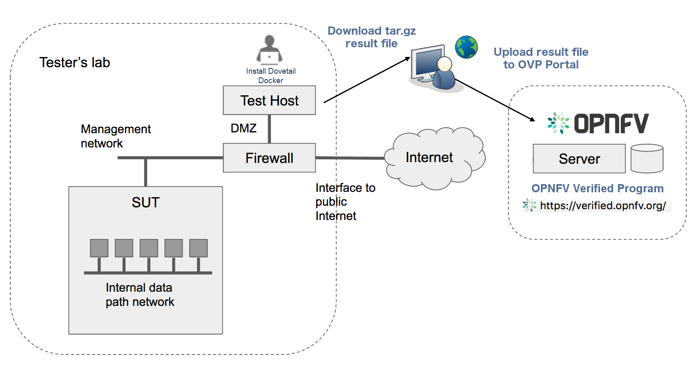

.. This work is licensed under a Creative Commons Attribution 4.0 International License.
.. http://creativecommons.org/licenses/by/4.0
.. (c) OPNFV, Huawei Technologies Co.,Ltd and others.

==========================================
Conducting OVP Testing with Dovetail
==========================================

Overview
------------------------------

The Dovetail testing framework for OVP consists of two major parts: the testing client that
executes all test cases in a lab (vendor self-testing or a third party lab),
and the server system that is hosted by the OVP administrator to store and
view test results based on a web API. The following diagram illustrates
this overall framework.

Within the tester's lab, the Test Host is the machine where Dovetail executes all
automated test cases. As it hosts the test harness, the Test Host must not be part of
the System Under Test (SUT) itself.
The above diagram assumes that the tester's Test Host is situated in a DMZ, which
has internal network access to the SUT and external access via the public Internet.
The public Internet connection allows for easy installation of the Dovetail containers.
A singular compressed file that includes all the underlying results can be pulled from
the Test Host and uploaded to the OPNFV OVP server.
This arrangement may not be supported in some labs. Dovetail also supports an offline mode of
installation that is illustrated in the next diagram.

.. image:: ../../../images/dovetail_offline_mode.png
    :align: center
    :scale: 50%

In the offline mode, the Test Host only needs to have access to the SUT
via the internal network, but does not need to connect to the public Internet. This
user guide will highlight differences between the online and offline modes of
the Test Host. While it is possible to run the Test Host as a virtual machine,
this user guide assumes it is a physical machine for simplicity.

The rest of this guide will describe how to install the Dovetail tool as a
Docker container image, go over the steps of running the OVP test suite, and
then discuss how to view test results and make sense of them.

Readers interested
in using Dovetail for its functionalities beyond OVP testing, e.g. for in-house
or extended testing, should consult the Dovetail developer's guide for additional
information.

Installing Dovetail
--------------------

In this section, we describe the procedure to install Dovetail client tool on the Test Host.
The Test Host must have network access to the management network with access rights to
the Virtual Infrastructure Manager's API.

Checking the Test Host Readiness
^^^^^^^^^^^^^^^^^^^^^^^^^^^^^^^^

The Test Host must have network access to the Virtual Infrastructure Manager's API
hosted in the SUT so that the Dovetail tool can exercise the API from the Test Host.
It must also have ``ssh`` access to the Linux operating system
of the compute nodes in the SUT. The ``ssh`` mechanism is used by some test cases
to generate test events in the compute nodes. You can find out which test cases
use this mechanism in the test specification document.

We have tested the Dovetail tool on the following host operating systems. Other versions
or distributions of Linux may also work, but community support may be more available on
these versions.

- Ubuntu 16.04.2 LTS (Xenial) or 14.04 LTS (Trusty)
- CentOS-7-1611
- Red Hat Enterprise Linux 7.3
- Fedora 24 or 25 Server

Use of Ubuntu 16.04 is highly recommended, as it has been most widely employed during testing.
Non-Linux operating systems, such as Windows and Mac OS, have not been tested
and are not supported.

If online mode is used, the tester should also validate that the Test Host can reach
the public Internet. For example,

.. code-block:: bash

   $ ping www.opnfv.org
   PING www.opnfv.org (50.56.49.117): 56 data bytes
   64 bytes from 50.56.49.117: icmp_seq=0 ttl=48 time=52.952 ms
   64 bytes from 50.56.49.117: icmp_seq=1 ttl=48 time=53.805 ms
   64 bytes from 50.56.49.117: icmp_seq=2 ttl=48 time=53.349 ms
   ...

Or, if the lab environment does not allow ping, try validating it using HTTPS instead.

.. code-block:: bash

   $ curl https://www.opnfv.org
   <!doctype html>

   <html lang="en-US" class="no-js">
   <head>
   ...

Installing Prerequisite Packages on the Test Host
^^^^^^^^^^^^^^^^^^^^^^^^^^^^^^^^^^^^^^^^^^^^^^^^^

The main prerequisite software for Dovetail is Docker.

Dovetail does not work with Docker versions prior to 1.12.3. We have validated
Dovetail with Docker 17.03 CE. Other versions of Docker later than 1.12.3 may
also work, but community support may be more available on Docker 17.03 CE or greater.

.. code-block:: bash

   $ sudo docker version
   Client:
   Version:      17.03.1-ce
   API version:  1.27
   Go version:   go1.7.5
   Git commit:   c6d412e
   Built:        Mon Mar 27 17:10:36 2017
   OS/Arch:      linux/amd64

   Server:
   Version:      17.03.1-ce
   API version:  1.27 (minimum version 1.12)
   Go version:   go1.7.5
   Git commit:   c6d412e
   Built:        Mon Mar 27 17:10:36 2017
   OS/Arch:      linux/amd64
   Experimental: false

If your Test Host does not have Docker installed, or Docker is older than 1.12.3,
or you have Docker version other than 17.03 CE and wish to change,
you will need to install, upgrade, or re-install in order to run Dovetail.
The Docker installation process
can be more complex, you should refer to the official
Docker installation guide that is relevant to your Test Host's operating system.

The above installation steps assume that the Test Host is in the online mode. For offline
testing, use the following offline installation steps instead.

In order to install Docker offline, download Docker static binaries and copy the
tar file to the Test Host, such as for Ubuntu14.04, you may follow the following link
to install,

.. code-block:: bash

   https://github.com/meetyg/docker-offline-install

Configuring the Test Host Environment
^^^^^^^^^^^^^^^^^^^^^^^^^^^^^^^^^^^^^

The Test Host needs a few environment variables set correctly in order to access the
Openstack API required to drive the Dovetail tests. For convenience and as a convention,
we will also create a home directory for storing all Dovetail related config files and
results files:

.. code-block:: bash

   $ mkdir -p ${HOME}/dovetail
   $ export DOVETAIL_HOME=${HOME}/dovetail

Here we set dovetail home directory to be ``${HOME}/dovetail`` for an example.
Then create 2 directories named ``pre_config`` and ``images`` in this directory
to store all Dovetail related config files and all VM images respectively:

.. code-block:: bash

   $ mkdir -p ${DOVETAIL_HOME}/pre_config
   $ mkdir -p ${DOVETAIL_HOME}/images

Setting up Primary Configuration File
^^^^^^^^^^^^^^^^^^^^^^^^^^^^^^^^^^^^^

At this point, you will need to consult your SUT (Openstack) administrator to correctly set
the configurations in a file named ``env_config.sh``.
The Openstack settings need to be configured such that the Dovetail client has all the necessary
credentials and privileges to execute all test operations. If the SUT uses terms
somewhat differently from the standard Openstack naming, you will need to adjust
this file accordingly.

Create and edit the file ``${DOVETAIL_HOME}/pre_config/env_config.sh`` so that
all parameters are set correctly to match your SUT. Here is an example of what
this file should contain.

.. code-block:: bash

   $ cat ${DOVETAIL_HOME}/pre_config/env_config.sh

   # Project-level authentication scope (name or ID), recommend admin project.
   export OS_PROJECT_NAME=admin

   # For identity v2, it uses OS_TENANT_NAME rather than OS_PROJECT_NAME.
   export OS_TENANT_NAME=admin

   # Authentication username, belongs to the project above, recommend admin user.
   export OS_USERNAME=admin

   # Authentication password. Use your own password
   export OS_PASSWORD=xxxxxxxx

   # Authentication URL, one of the endpoints of keystone service. If this is v3 version,
   # there need some extra variables as follows.
   export OS_AUTH_URL='http://xxx.xxx.xxx.xxx:5000/v3'

   # Default is 2.0. If use keystone v3 API, this should be set as 3.
   export OS_IDENTITY_API_VERSION=3

   # Domain name or ID containing the user above.
   # Command to check the domain: openstack user show <OS_USERNAME>
   export OS_USER_DOMAIN_NAME=default

   # Domain name or ID containing the project above.
   # Command to check the domain: openstack project show <OS_PROJECT_NAME>
   export OS_PROJECT_DOMAIN_NAME=default

   # Special environment parameters for https.
   # If using https + cacert, the path of cacert file should be provided.
   # The cacert file should be put at $DOVETAIL_HOME/pre_config.
   export OS_CACERT=/path/to/pre_config/cacert.pem

   # If using https + no cacert, should add OS_INSECURE environment parameter.
   export OS_INSECURE=True

   # The name of a network with external connectivity for allocating floating
   # IPs. It is required that at least one Neutron network with the attribute
   # 'router:external=True' is pre-configured on the system under test.
   # This network is used by test cases to SSH into tenant VMs and perform
   # operations there.
   export EXTERNAL_NETWORK=xxx

The OS_AUTH_URL variable is key to configure correctly, as the other admin services
are gleaned from the identity service. HTTPS should be configured in the SUT so the
final two variables should be uncommented. However, if SSL is disabled in the SUT, comment
out the OS_CACERT and OS_INSECURE variables. Ensure the '/path/to/pre_config' directory in
the above file matches the directory location of the cacert file for the OS_CACERT variable.

Export all these variables into environment by,

.. code-block:: bash

   $ source ${DOVETAIL_HOME}/pre_config/env_config.sh

The above line may be added to your .bashrc file for convenience when repeatedly using
Dovetail.

The next three sections outline additional configuration files used by Dovetail. The
tempest (tempest_conf.yaml) configuration file is required for executing all tempest
test cases (e.g. dovetail.tempest.compute, dovetail.tempest.ipv6 ...) and
dovetail.security.patrole. The HA (pod.yaml) configuration
file is required for HA test cases and is also employed to collect SUT hardware
info. The hosts.yaml is optional for hostname/IP resolution.

Configuration for Running Tempest Test Cases (Mandatory)
^^^^^^^^^^^^^^^^^^^^^^^^^^^^^^^^^^^^^^^^^^^^^^^^^^^^^^^^

The test cases in the test areas `tempest` and `security`
are based on Tempest. A SUT-specific configuration of
Tempest is required in order to run those test cases successfully. The
corresponding SUT-specific configuration options must be supplied in the file
``$DOVETAIL_HOME/pre_config/tempest_conf.yaml``.

Create and edit file ``$DOVETAIL_HOME/pre_config/tempest_conf.yaml``.
Here is an example of what this file should contain.

.. code-block:: bash

   compute:
     # The minimum number of compute nodes expected.
     # This should be no less than 2 and no larger than the compute nodes the SUT actually has.
     min_compute_nodes: 2

     # Expected device name when a volume is attached to an instance.
     volume_device_name: vdb

Use the listing above as a minimum to execute the mandatory test areas.

If the optional BGPVPN Tempest API tests shall be run, Tempest needs to be told
that the BGPVPN service is available. To do that, add the following to the
``$DOVETAIL_HOME/pre_config/tempest_conf.yaml`` configuration file:

.. code-block:: bash

  service_available:
    bgpvpn: True

Configuration for Running HA Test Cases (Mandatory)
^^^^^^^^^^^^^^^^^^^^^^^^^^^^^^^^^^^^^^^^^^^^^^^^^^^

The HA test cases require OpenStack controller node info. It must include the node's
name, role, ip, as well as the user and key_filename or password to login to the node. Users
must create the file ``${DOVETAIL_HOME}/pre_config/pod.yaml`` to store the info.
For some HA test cases, they will log in the controller node 'node1' and kill the specific processes.
The names of the specific processes may be different with the actual ones of the SUTs.
The process names can also be changed with file ``${DOVETAIL_HOME}/pre_config/pod.yaml``.

This file is also used as basis to collect SUT hardware information that is stored alongside results and
uploaded to the OVP web portal. The SUT hardware information can be viewed within the
'My Results' view in the OVP web portal by clicking the SUT column 'info' link. In order to
collect SUT hardware information holistically, ensure this file has an entry for each of
the controller and compute nodes within the SUT.

Below is a sample with the required syntax when password is employed by the controller.

.. code-block:: bash

   nodes:
   -
       # This can not be changed and must be node0.
       name: node0

       # This must be Jumpserver.
       role: Jumpserver

       # This is the install IP of a node which has ipmitool installed.
       ip: xx.xx.xx.xx

       # User name of this node. This user must have sudo privileges.
       user: root

       # Password of the user.
       password: root

   -
       # This can not be changed and must be node1.
       name: node1

       # This must be controller.
       role: Controller

       # This is the install IP of a controller node, which is the haproxy primary node
       ip: xx.xx.xx.xx

       # User name of this node. This user must have sudo privileges.
       user: root

       # Password of the user.
       password: root

   process_info:
   -
       # The default attack process of dovetail.ha.rabbitmq is 'rabbitmq-server'.
       # Here can reset it to be 'rabbitmq'.
       testcase_name: dovetail.ha.rabbitmq
       attack_process: rabbitmq

   -
       # The default attack host for all HA test cases is 'node1'.
       # Here can reset it to be any other node given in the section 'nodes'.
       testcase_name: dovetail.ha.glance_api
       attack_host: node2

Besides the 'password', a 'key_filename' entry can be provided to login to the controller node.
Users need to create file ``$DOVETAIL_HOME/pre_config/id_rsa`` to store the private key.
A sample is provided below to show the required syntax when using a key file.

.. code-block:: bash

   nodes:
   -
       name: node1
       role: Controller
       ip: 10.1.0.50
       user: root

       # Private ssh key for accessing the controller nodes. If a keyfile is
       # being used, the path specified **must** be as shown below as this
       # is the location of the user-provided private ssh key inside the
       # Yardstick container.
       key_filename: /home/opnfv/userconfig/pre_config/id_rsa

Under nodes, repeat entries for name, role, ip, user and password or key file for each of the
controller/compute nodes that comprise the SUT. Use a '-' to separate each of the entries.
Specify the value for the role key to be either 'Controller' or 'Compute' for each node.

Under process_info, repeat entries for testcase_name, attack_host and attack_process
for each HA test case. Use a '-' to separate each of the entries.
The default attack host of all HA test cases is **node1**.
The default attack processes of all HA test cases are list here,

   +------------------------------+-------------------------+
   |      Test Case Name          |  Attack Process Name    |
   +==============================+=========================+
   | dovetail.ha.cinder_api       |   cinder-api            |
   +------------------------------+-------------------------+
   | dovetail.ha.database         |   mysql                 |
   +------------------------------+-------------------------+
   | dovetail.ha.glance_api       |   glance-api            |
   +------------------------------+-------------------------+
   | dovetail.ha.haproxy          |   haproxy               |
   +------------------------------+-------------------------+
   | dovetail.ha.keystone         |   keystone              |
   +------------------------------+-------------------------+
   | dovetail.ha.neutron_l3_agent |   neutron-l3-agent      |
   +------------------------------+-------------------------+
   | dovetail.ha.neutron_server   |   neutron-server        |
   +------------------------------+-------------------------+
   | dovetail.ha.nova_api         |   nova-api              |
   +------------------------------+-------------------------+
   | dovetail.ha.rabbitmq         |   rabbitmq-server       |
   +------------------------------+-------------------------+

Configuration of Hosts File (Optional)
^^^^^^^^^^^^^^^^^^^^^^^^^^^^^^^^^^^^^^

If your SUT uses a hosts file to translate hostnames into the IP of OS_AUTH_URL, then you need
to provide the hosts info in a file ``$DOVETAIL_HOME/pre_config/hosts.yaml``.

Create and edit file ``$DOVETAIL_HOME/pre_config/hosts.yaml``. Below is an example of what
this file should contain. Note, that multiple hostnames can be specified for each IP address,
as shown in the generic syntax below the example.

.. code-block:: bash

   $ cat ${DOVETAIL_HOME}/pre_config/hosts.yaml

   ---
   hosts_info:
     192.168.141.101:
       - ha-vip

     <ip>:
       - <hostname1>
       - <hostname2>

Installing Dovetail on the Test Host
^^^^^^^^^^^^^^^^^^^^^^^^^^^^^^^^^^^^

The Dovetail project maintains a Docker image that has Dovetail test tools preinstalled.
This Docker image is tagged with versions. Before pulling the Dovetail image, check the
OPNFV's OVP web page first to determine the right tag for OVP testing.

Online Test Host
""""""""""""""""

If the Test Host is online, you can directly pull Dovetail Docker image and download Ubuntu
and Cirros images. All other dependent docker images will automatically be downloaded. The
Ubuntu and Cirros images are used by Dovetail for image creation and VM instantiation within
the SUT.

.. code-block:: bash

   $ wget -nc http://download.cirros-cloud.net/0.4.0/cirros-0.4.0-x86_64-disk.img -P ${DOVETAIL_HOME}/images
   $ wget -nc https://cloud-images.ubuntu.com/releases/14.04/release/ubuntu-14.04-server-cloudimg-amd64-disk1.img -P ${DOVETAIL_HOME}/images
   $ wget -nc https://cloud-images.ubuntu.com/releases/16.04/release/ubuntu-16.04-server-cloudimg-amd64-disk1.img -P ${DOVETAIL_HOME}/images
   $ wget -nc http://repository.cloudifysource.org/cloudify/4.0.1/sp-release/cloudify-manager-premium-4.0.1.qcow2 -P ${DOVETAIL_HOME}/images

   $ sudo docker pull opnfv/dovetail:latest
   latest: Pulling from opnfv/dovetail
   324d088ce065: Pull complete
   2ab951b6c615: Pull complete
   9b01635313e2: Pull complete
   04510b914a6c: Pull complete
   83ab617df7b4: Pull complete
   40ebbe7294ae: Pull complete
   d5db7e3e81ae: Pull complete
   0701bf048879: Pull complete
   0ad9f4168266: Pull complete
   d949894f87f6: Pull complete
   Digest: sha256:7449601108ebc5c40f76a5cd9065ca5e18053be643a0eeac778f537719336c29
   Status: Downloaded newer image for opnfv/dovetail:latest

An example of the <tag> is **latest**.

Offline Test Host
"""""""""""""""""

If the Test Host is offline, you will need to first pull the Dovetail Docker image, and all the
dependent images that Dovetail uses, to a host that is online. The reason that you need
to pull all dependent images is because Dovetail normally does dependency checking at run-time
and automatically pulls images as needed, if the Test Host is online. If the Test Host is
offline, then all these dependencies will need to be manually copied.

.. code-block:: bash

   $ sudo docker pull opnfv/dovetail:latest
   $ sudo docker pull opnfv/functest-smoke:fraser
   $ sudo docker pull opnfv/functest-healthcheck:fraser
   $ sudo docker pull opnfv/functest-features:fraser
   $ sudo docker pull opnfv/functest-vnf:fraser
   $ sudo docker pull opnfv/yardstick:stable
   $ sudo docker pull opnfv/bottlenecks:stable
   $ wget -nc http://download.cirros-cloud.net/0.4.0/cirros-0.4.0-x86_64-disk.img -P {ANY_DIR}
   $ wget -nc https://cloud-images.ubuntu.com/releases/14.04/release/ubuntu-14.04-server-cloudimg-amd64-disk1.img -P {ANY_DIR}
   $ wget -nc https://cloud-images.ubuntu.com/releases/16.04/release/ubuntu-16.04-server-cloudimg-amd64-disk1.img -P {ANY_DIR}
   $ wget -nc http://repository.cloudifysource.org/cloudify/4.0.1/sp-release/cloudify-manager-premium-4.0.1.qcow2 -P {ANY_DIR}

Once all these images are pulled, save the images, copy to the Test Host, and then load
the Dovetail image and all dependent images at the Test Host. The final 4 lines above are
to obtain the test images for transfer to the Test Host.

At the online host, save the images with the command below.

.. code-block:: bash

   $ sudo docker save -o dovetail.tar opnfv/dovetail:latest \
     opnfv/functest-smoke:fraser opnfv/functest-healthcheck:fraser \
     opnfv/functest-features:fraser opnfv/functest-vnf:fraser \
     opnfv/yardstick:stable opnfv/bottlenecks:stable

The command above creates a dovetail.tar file with all the images, which can then be copied
to the Test Host. To load the Dovetail images on the Test Host execute the command below.

.. code-block:: bash

   $ sudo docker load --input dovetail.tar

Now check to see that all Docker images have been pulled or loaded properly.

.. code-block:: bash

   $ sudo docker images
   REPOSITORY                      TAG                 IMAGE ID            CREATED             SIZE
   opnfv/dovetail                  latest              ac3b2d12b1b0        24 hours ago        784 MB
   opnfv/functest-smoke            fraser              010aacb7c1ee        17 hours ago        594.2 MB
   opnfv/functest-healthcheck      fraser              2cfd4523f797        17 hours ago        234 MB
   opnfv/functest-features         fraser              b61d4abd56fd        17 hours ago        530.5 MB
   opnfv/functest-vnf              fraser              929e847a22c3        17 hours ago        1.87 GB
   opnfv/yardstick                 stable              84b4edebfc44        17 hours ago        2.052 GB
   opnfv/bottlenecks               stable              3d4ed98a6c9a        21 hours ago        638 MB

After copying and loading the Dovetail images at the Test Host, also copy the test images
(Ubuntu, Cirros and cloudify-manager) to the Test Host.
Copy image ``cirros-0.4.0-x86_64-disk.img`` to ``${DOVETAIL_HOME}/images/``.
Copy image ``ubuntu-14.04-server-cloudimg-amd64-disk1.img`` to ``${DOVETAIL_HOME}/images/``.
Copy image ``ubuntu-16.04-server-cloudimg-amd64-disk1.img`` to ``${DOVETAIL_HOME}/images/``.
Copy image ``cloudify-manager-premium-4.0.1.qcow2`` to ``${DOVETAIL_HOME}/images/``.

Starting Dovetail Docker
------------------------

Regardless of whether you pulled down the Dovetail image directly online, or loaded from
a static image tar file, you are now ready to run Dovetail. Use the command below to
create a Dovetail container and get access to its shell.

.. code-block:: bash

   $ sudo docker run --privileged=true -it \
             -e DOVETAIL_HOME=$DOVETAIL_HOME \
             -v $DOVETAIL_HOME:$DOVETAIL_HOME \
             -v /var/run/docker.sock:/var/run/docker.sock \
             opnfv/dovetail:<tag> /bin/bash

The ``-e`` option sets the DOVETAIL_HOME environment variable in the container and the
``-v`` options map files in the Test Host to files in the container. The latter option
allows the Dovetail container to read the configuration files and write result files into
DOVETAIL_HOME on the Test Host. The user should be within the Dovetail container shell,
once the command above is executed.

Running the OVP Test Suite
----------------------------

All or a subset of the available tests can be executed at any location within the
Dovetail container prompt. You can refer to :ref:`cli-reference`
for the details of the CLI.

.. code-block:: bash

   $ dovetail run --testsuite <test-suite-name>

The '--testsuite' option is used to control the set of tests intended for execution
at a high level. For the purposes of running the OVP test suite, the test suite name follows
the following format, ``ovp.<major>.<minor>.<patch>``. The latest and default test suite is
ovp.next.

.. code-block:: bash

   $ dovetail run

This command is equal to

.. code-block:: bash

   $ dovetail run --testsuite ovp.next

Without any additional options, the above command will attempt to execute all mandatory and
optional test cases with test suite ovp.next.
To restrict the breadth of the test scope, test areas can also be
specified using the '--testarea' option. The test area can be specified broadly using arguments
'mandatory' and 'optional'. The mandatory tests can be narrowed further using test area arguments
'osinterop', 'vping' and 'ha'. The optional tests can be narrowed further using test area
arguments 'ipv6', 'sdnvpn' and 'tempest'.

.. code-block:: bash

   $ dovetail run --testarea mandatory

Also there is a '--testcase' option provided to run a specified test case.

.. code-block:: bash

   $ dovetail run --testcase dovetail.tempest.osinterop

Dovetail allows the user to disable strict API response validation implemented
by Nova Tempest tests by means of the ``--no-api-validation`` option. Usage of
this option is only advisable if the SUT returns Nova API responses that
contain additional attributes. For more information on this command line option
and its intended usage, refer to
:ref:`dovetail-exemption_process_api_response_validation`.

.. code-block:: bash

   $ dovetail run --testcase dovetail.tempest.osinterop --deploy-scenario os-nosdn-ovs-ha

By default, during test case execution, the respective feature is responsible to
decide what flavor is going to use for the execution of each test scenario which is under
of its umbrella.
In parallel, there is also implemented a mechanism in order for the extra specs in flavors of
executing test scenarios to be hugepages instead of the default option.
This is happening if the name of the scenario contains the substring "ovs".
In this case, the flavor which is going to be used for the running test case has
'hugepage' characteristics.

Taking the above into our consideration and having in our mind that the DEPLOY_SCENARIO
environment parameter is not used by dovetail framework (the initial value is 'unknown'),
we set as input, for the features that they are responsible for the test case execution,
the DEPLOY_SCENARIO environment parameter having as substring the feature name "ovs"
(e.g. os-nosdn-ovs-ha).

.. code-block:: bash

   $ dovetail run --no-api-validation

By default, results are stored in local files on the Test Host at ``$DOVETAIL_HOME/results``.
Each time the 'dovetail run' command is executed, the results in the aforementioned directory
are overwritten. To create a singular compressed result file for upload to the OVP portal or
for archival purposes, the tool provided an option '--report'.

.. code-block:: bash

   $ dovetail run --report

If the Test Host is offline, ``--offline`` should be added to support running with
local resources.

.. code-block:: bash

   $ dovetail run --offline

Below is an example of running one test case and the creation of the compressed
result file on the Test Host.

.. code-block:: bash

   $ dovetail run --offline --testcase dovetail.vping.userdata --report
   2018-05-22 08:16:16,353 - run - INFO - ================================================
   2018-05-22 08:16:16,353 - run - INFO - Dovetail compliance: ovp.next!
   2018-05-22 08:16:16,353 - run - INFO - ================================================
   2018-05-22 08:16:16,353 - run - INFO - Build tag: daily-master-660de986-5d98-11e8-b635-0242ac110001
   2018-05-22 08:19:31,595 - run - WARNING - There is no hosts file /home/dovetail/pre_config/hosts.yaml, may be some issues with domain name resolution.
   2018-05-22 08:19:31,595 - run - INFO - Get hardware info of all nodes list in file /home/dovetail/pre_config/pod.yaml ...
   2018-05-22 08:19:39,778 - run - INFO - Hardware info of all nodes are stored in file /home/dovetail/results/all_hosts_info.json.
   2018-05-22 08:19:39,961 - run - INFO - >>[testcase]: dovetail.vping.userdata
   2018-05-22 08:31:17,961 - run - INFO - Results have been stored with file /home/dovetail/results/functest_results.txt.
   2018-05-22 08:31:17,969 - report.Report - INFO -

   Dovetail Report
   Version: 1.0.0
   Build Tag: daily-master-660de986-5d98-11e8-b635-0242ac110001
   Upload Date: 2018-05-22 08:31:17 UTC
   Duration: 698.01 s

   Pass Rate: 100.00% (1/1)
   vping:                     pass rate 100.00%
   -dovetail.vping.userdata   PASS

When test execution is complete, a tar file with all result and log files is written in
``$DOVETAIL_HOME`` on the Test Host. An example filename is
``${DOVETAIL_HOME}/logs_20180105_0858.tar.gz``. The file is named using a
timestamp that follows the convention 'YearMonthDay-HourMinute'. In this case, it was generated
at 08:58 on January 5th, 2018. This tar file is used to upload to the OVP portal.

Making Sense of OVP Test Results
^^^^^^^^^^^^^^^^^^^^^^^^^^^^^^^^

When a tester is performing trial runs, Dovetail stores results in local files on the Test
Host by default within the directory specified below.

.. code-block:: bash

       cd $DOVETAIL_HOME/results

#. Local file

   * Log file: dovetail.log

     * Review the dovetail.log to see if all important information has been captured
       - in default mode without DEBUG.

     * Review the results.json to see all results data including criteria for PASS or FAIL.

   * Tempest and security test cases

     * Can see the log details in ``tempest_logs/dovetail.tempest.XXX.html`` and
       ``security_logs/dovetail.security.XXX.html`` respectively,
       which has the passed, skipped and failed test cases results.

     * This kind of files need to be opened with a web browser.

     * The skipped test cases have the reason for the users to see why these test cases skipped.

     * The failed test cases have rich debug information for the users to see why these test cases fail.

   * Vping test cases

     * Its log is stored in dovetail.log.

     * Its result is stored in functest_results.txt.

   * HA test cases

     * Its log is stored in dovetail.log.

     * Its result is stored in dovetail.ha.XXX.out.

   * Snaps test cases

     * Its log is stored in functest.log.

     * Its result is stored in functest_results.txt.

   * Stress test cases

     * Its log is stored in bottlenecks.log.

     * Its result is stored in dovetail.stress.ping.out.

   * VNF test cases

     * Its log is stored in functest.log.

     * Its result is stored in functest_results.txt.

   * Sdnvpn test cases

     * Can see the log details in ``sdnvpn_logs/dovetail.sdnvpn.XXX.log``.

     * Its result is stored in functest_results.txt.

OVP Portal Web Interface
------------------------

The OVP portal is a public web interface for the community to collaborate on results
and to submit results for official OPNFV compliance verification. The portal can be used as a
resource by users and testers to navigate and inspect results more easily than by manually
inspecting the log files. The portal also allows users to share results in a private manner
until they are ready to submit results for peer community review.

   * Web Site URL

     * https://verified.opnfv.org

   * Sign In / Sign Up Links

     * Accounts are exposed through Linux Foundation or OpenStack account credentials.

     * If you already have a Linux Foundation ID, you can sign in directly with your ID.

     * If you do not have a Linux Foundation ID, you can sign up for a new one using 'Sign Up'

   * My Results Tab

     * This is the primary view where most of the workflow occurs.

     * This page lists all results uploaded by you after signing in.

     * You can also upload results on this page with the two steps below.

     * Obtain results tar file located at ``${DOVETAIL_HOME}/``, example ``logs_20180105_0858.tar.gz``

     * Use the *Choose File* button where a file selection dialog allows you to choose your result
       file from the hard-disk. Then click the *Upload* button and see a results ID once your
       upload succeeds.

     * Results are status 'private' until they are submitted for review.

     * Use the *Operation* column drop-down option 'submit to review', to expose results to
       OPNFV community peer reviewers. Use the 'withdraw submit' option to reverse this action.

     * Use the *Operation* column drop-down option 'share with' to share results with other
       users by supplying either the login user ID or the email address associated with
       the share target account. The result is exposed to the share target but remains private
       otherwise.

   * Profile Tab

     * This page shows your account info after you sign in.

Updating Dovetail or a Test Suite
---------------------------------

Follow the instructions in section `Installing Dovetail on the Test Host`_ and
`Running the OVP Test Suite`_ by replacing the docker images with new_tags,

.. code-block:: bash

   sudo docker pull opnfv/dovetail:<dovetail_new_tag>
   sudo docker pull opnfv/functest:<functest_new_tag>
   sudo docker pull opnfv/yardstick:<yardstick_new_tag>

This step is necessary if dovetail software or the OVP test suite have updates.

