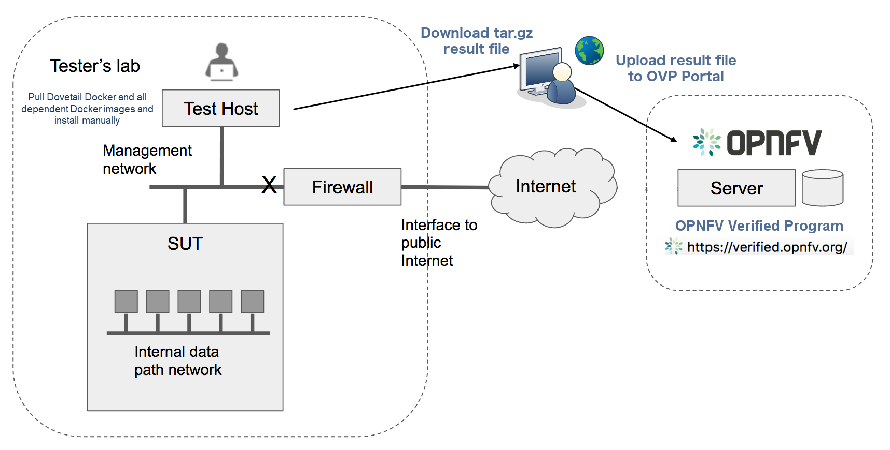

.. This work is licensed under a Creative Commons Attribution 4.0 International License.
.. http://creativecommons.org/licenses/by/4.0
.. (c) OPNFV, Huawei Technologies Co.,Ltd and others.

==========================================
Conducting CVP Testing with Dovetail
==========================================

Overview
------------------------------

The Dovetail testing framework for CVP consists of two major parts: the testing client that
executes all test cases in a lab (vendor self-testing or a third party lab),
and the server system that is hosted by the CVP administrator to store and
view test results based on a web API. The following diagram illustrates
this overall framework.

.. image:: ../../../images/dovetail_online_mode.png
    :align: center
    :scale: 50%

Within the tester's lab, the Test Host is the machine where Dovetail executes all
automated test cases. As it hosts the test harness, the Test Host must not be part of
the System Under Test (SUT) itself.
The above diagram assumes that the tester's Test Host is situated in a DMZ, which
has internal network access to the SUT and external access via the public Internet.
The public Internet connection allows for easy installation of the Dovetail containers.
A singular compressed file that includes all the underlying results can be pulled from
the Test Host and uploaded to the OPNFV CVP server.
This arrangement may not be supported in some labs. Dovetail also supports an offline mode of
installation that is illustrated in the next diagram.

In the offline mode, the Test Host only needs to have access to the SUT
via the internal network, but does not need to connect to the public Internet. This
user guide will highlight differences between the online and offline modes of
the Test Host. While it is possible to run the Test Host as a virtual machine,
this user guide assumes it is a physical machine for simplicity.

The rest of this guide will describe how to install the Dovetail tool as a
Docker container image, go over the steps of running the CVP test suite, and
then discuss how to view test results and make sense of them.

Readers interested
in using Dovetail for its functionalities beyond CVP testing, e.g. for in-house
or extended testing, should consult the Dovetail developer's guide for additional
information.

Installing Dovetail
--------------------

In this section, we describe the procedure to install Dovetail client tool on the Test Host.
The Test Host must have network access to the management network with access rights to
the Virtual Infrastructure Manager's API.

Checking the Test Host Readiness
^^^^^^^^^^^^^^^^^^^^^^^^^^^^^^^

The Test Host must have network access to the Virtual Infrastructure Manager's API
hosted in the SUT so that the Dovetail tool can exercise the API from the Test Host.
It must also have ``ssh`` access to the Linux operating system
of the compute nodes in the SUT. The ``ssh`` mechanism is used by some test cases
to generate test events in the compute nodes. You can find out which test cases
use this mechanism in the test specification document.

We have tested the Dovetail tool on the following host operating systems. Other versions
or distribution of Linux may also work, but community support may be more available on
these versions.

- Ubuntu 16.04.2 LTS (Xenial) or 14.04 LTS (Trusty)
- CentOS-7-1611
- Red Hat Enterprise Linux 7.3
- Fedora 24 or 25 Server

Non-Linux operating systems, such as Windows, Mac OS, have not been tested
and are not supported.

If online mode is used, the tester should also validate that the Test Host can reach
the public Internet. For example,

.. code-block:: bash

   $ ping www.opnfv.org
   PING www.opnfv.org (50.56.49.117): 56 data bytes
   64 bytes from 50.56.49.117: icmp_seq=0 ttl=48 time=52.952 ms
   64 bytes from 50.56.49.117: icmp_seq=1 ttl=48 time=53.805 ms
   64 bytes from 50.56.49.117: icmp_seq=2 ttl=48 time=53.349 ms
   ...

Or, if the lab environment does not allow ping, try validating it using HTTPS instead.

.. code-block:: bash

   $ curl https://www.opnfv.org
   <!doctype html>

   <html lang="en-US" class="no-js">
   <head>
   ...

Configuring the Test Host Environment
^^^^^^^^^^^^^^^^^^^^^^^^^^^^^^^^^^^^^^

The Test Host needs a few environment variables set correctly in order to access the
Openstack API required to drive the Dovetail tests. For convenience and as a convention,
we will also create a home directory for storing all Dovetail related config files and
results files:

.. code-block:: bash

   $ mkdir -p /home/dovetail
   $ export DOVETAIL_HOME=/home/dovetail

Here we set dovetail home directory to be ``/home/dovetail`` for an example.
Then create a directory named ``pre_config`` in this directory to store all
Dovetail related config files:

.. code-block:: bash

   $ mkdir -p ${DOVETAIL_HOME}/pre_config

At this point, you will need to consult your SUT (Openstack) administrator to correctly set
the configurations in a file named ``env_config.sh``.
The Openstack settings need to be configured such that the Dovetail client has all the necessary
credentials and privileges to execute all test operations. If the SUT uses terms
somewhat differently from the standard Openstack naming, you will need to adjust
this file accordingly.

Create and edit the file ``${DOVETAIL_HOME}/pre_config/env_config.sh`` so that
all parameters are set correctly to match your SUT. Here is an example of what
this file should contain.

.. code-block:: bash

   $ cat ${DOVETAIL_HOME}/pre_config/env_config.sh

   # Project-level authentication scope (name or ID), recommend admin project.
   export OS_PROJECT_NAME=admin

   # For identity v2, it uses OS_TENANT_NAME rather than OS_PROJECT_NAME.
   export OS_TENANT_NAME=admin

   # Authentication username, belongs to the project above, recommend admin user.
   export OS_USERNAME=admin

   # Authentication password. Use your own password
   export OS_PASSWORD=xxxxxxxx

   # Authentication URL, one of the endpoints of keystone service. If this is v3 version,
   # there need some extra variables as follows.
   export OS_AUTH_URL='http://xxx.xxx.xxx.xxx:5000/v3'

   # Default is 2.0. If use keystone v3 API, this should be set as 3.
   export OS_IDENTITY_API_VERSION=3

   # Domain name or ID containing the user above.
   # Command to check the domain: openstack user show <OS_USERNAME>
   export OS_USER_DOMAIN_NAME=default

   # Domain name or ID containing the project above.
   # Command to check the domain: openstack project show <OS_PROJECT_NAME>
   export OS_PROJECT_DOMAIN_NAME=default

   # Home directory for dovetail that you have created before.
   export DOVETAIL_HOME=/home/dovetail

   # Special environment parameters for https.
   # If using https + cacert, the path of cacert file should be provided.
   # The cacert file should be put at $DOVETAIL_HOME/pre_config.
   export OS_CACERT=$DOVETAIL_HOME/pre_config/cacert.pem

   # If using https + no cacert, should add OS_INSECURE environment parameter.
   export OS_INSECURE=True

Export all these variables into environment by,

.. code-block:: bash

   $ source ${DOVETAIL_HOME}/pre_config/env_config.sh

If your SUT uses hosts file to translate hostnames into the IP
of OS_AUTH_URL, then you need to provide these hosts info in file
``$DOVETAIL_HOME/pre_config/hosts.yaml``.

Create and edit file ``$DOVETAIL_HOME/pre_config/hosts.yaml``. Here is an example of
what this file should contain.

.. code-block:: bash

   $ cat ${DOVETAIL_HOME}/pre_config/hosts.yaml

   ---
   hosts_info:
     - image.xx.xx.xx.com:172.xxx.xxx.xxx
     - compute.xx.xx.xx.com:172.xxx.xxx.xxx
     - <Hostname>:<IPaddress>

Installing Prerequisite on the Test Host
^^^^^^^^^^^^^^^^^^^^^^^^^^^^^^^^^^^^^^^^^^^

The main prerequisite software for Dovetail are Python and Docker.

In the CVP test suite for the Danube release, Dovetail requires Python 2.7. Python 3.x
is not supported at this time.

Use the following steps to check if the right version of python is already installed,
and if not, install it.

.. code-block:: bash

   $ python --version
   Python 2.7.6

If your Test Host does not have Python installed, or the version is not 2.7, you
should consult Python installation guides corresponding to the operating system
in your Test Host on how to install Python 2.7.

Dovetail does not work with Docker versions prior to 1.12.3. We have validated
Dovetail with Docker 17.03 CE. Other versions of Docker later than 1.12.3 may
also work, but community support may be more available on Docker 17.03 CE.

.. code-block:: bash

   $ sudo docker version
   Client:
   Version:      17.03.1-ce
   API version:  1.27
   Go version:   go1.7.5
   Git commit:   c6d412e
   Built:        Mon Mar 27 17:10:36 2017
   OS/Arch:      linux/amd64

   Server:
   Version:      17.03.1-ce
   API version:  1.27 (minimum version 1.12)
   Go version:   go1.7.5
   Git commit:   c6d412e
   Built:        Mon Mar 27 17:10:36 2017
   OS/Arch:      linux/amd64
   Experimental: false

If your Test Host does not have Docker installed, or Docker is older than 1.12.3,
or you have Docker version other than 17.03 CE and wish to change,
you will need to install, upgrade, or re-install in order to run Dovetail.
The Docker installation process
can be more complex, you should refer to the official
Docker installation guide that is relevant to your Test Host's operating system.

The above installation steps assume that the Test Host is in the online mode. For offline
testing, use the following offline installation steps instead.

In order to install or upgrade Python offline, you may download packaged Python 2.7
for your Test Host's operating system on a connected host, copy the packge to
the Test Host, then install from that local copy.

In order to install Docker offline, download Docker static binaries and copy the
tar file to the Test Host, such as for Ubuntu14.04, you may follow the following link
to install,

.. code-block:: bash

   https://github.com/meetyg/docker-offline-install

Installing Dovetail on the Test Host
^^^^^^^^^^^^^^^^^^^^^^^^^^^^^^^^^^^^

The Dovetail project maintains a Docker image that has Dovetail test tools preinstalled.
This Docker image is tagged with versions. Before pulling the Dovetail image, check the
OPNFV's CVP web page first to determine the right tag for CVP testing.

If the Test Host is online, you can directly pull Dovetail Docker image and download ubuntu
and cirros images.

.. code-block:: bash

   $ sudo wget -nc http://artifacts.opnfv.org/sdnvpn/ubuntu-16.04-server-cloudimg-amd64-disk1.img -P ${DOVETAIL_HOME}/pre_config
   $ sudo wget -nc http://download.cirros-cloud.net/0.3.5/cirros-0.3.5-x86_64-disk.img -P ${DOVETAIL_HOME}/pre_config

   $ sudo docker pull opnfv/dovetail:cvp.0.7.0
   cvp.0.7.0: Pulling from opnfv/dovetail
   30d541b48fc0: Pull complete
   8ecd7f80d390: Pull complete
   46ec9927bb81: Pull complete
   2e67a4d67b44: Pull complete
   7d9dd9155488: Pull complete
   cc79be29f08e: Pull complete
   e102eed9bf6a: Pull complete
   952b8a9d2150: Pull complete
   bfbb639d1f38: Pull complete
   bf7c644692de: Pull complete
   cdc345e3f363: Pull complete
   Digest: sha256:d571b1073b2fdada79562e8cc67f63018e8d89268ff7faabee3380202c05edee
   Status: Downloaded newer image for opnfv/dovetail:cvp.0.7.0

An example of the <tag> is *cvp.0.7.0*.

If the Test Host is offline, you will need to first pull the Dovetail Docker image, and all the
dependent images that Dovetail uses, to a host that is online. The reason that you need
to pull all dependent images is because Dovetail normally does dependency checking at run-time
and automatically pull images as needed, if the Test Host is online. If the Test Host is
offline, then all these dependencies will also need to be manually copied.

.. code-block:: bash

   $ sudo docker pull opnfv/dovetail:cvp.0.7.0
   $ sudo docker pull opnfv/functest:cvp.0.5.0
   $ sudo docker pull opnfv/yardstick:danube.3.2
   $ sudo docker pull opnfv/bottlenecks:cvp.0.4.0
   $ sudo docker pull opnfv/testapi:cvp.0.3.0
   $ sudo docker pull mongo:3.2.1
   $ sudo wget -nc http://artifacts.opnfv.org/sdnvpn/ubuntu-16.04-server-cloudimg-amd64-disk1.img -P {ANY_DIR}
   $ sudo wget -nc http://download.cirros-cloud.net/0.3.5/cirros-0.3.5-x86_64-disk.img -P {ANY_DIR}

Once all these images are pulled, save the images, copy to the Test Host, and then load
the Dovetail and all dependent images at the Test Host.

At the online host, save images.

.. code-block:: bash

   $ sudo docker save -o dovetail.tar opnfv/dovetail:cvp.0.7.0 \
     opnfv/functest:cvp.0.5.0 opnfv/yardstick:danube.3.2 \
     opnfv/bottlenecks:cvp.0.4.0 opnfv/testapi:cvp.0.3.0 mongo:3.2.1

Copy dovetail.tar file to the Test Host, and then load the images on the Test Host.

.. code-block:: bash

   $ sudo docker load --input dovetail.tar

Copy sdnvpn test area image ubuntu-16.04-server-cloudimg-amd64-disk1.img to ``${DOVETAIL_HOME}/pre_config/``.
Copy cirros image cirros-0.3.5-x86_64-disk.img to ``${DOVETAIL_HOME}/pre_config/``.

Now check to see that all Docker images have been pulled or loaded properly.

.. code-block:: bash

   $ sudo docker images
   REPOSITORY          TAG                 IMAGE ID            CREATED             SIZE
   opnfv/functest      cvp.0.5.0           e2b286547478        6 weeks ago         1.26 GB
   opnfv/dovetail      cvp.0.7.0           5d25b289451c        8 days ago          516MB
   opnfv/yardstick     danube.3.2          df830d5c2cb2        6 weeks ago         1.21 GB
   opnfv/bottlenecks   cvp.0.4.0           00450688bcae        7 weeks ago         622 MB
   opnfv/testapi       cvp.0.3.0           05c6d5ebce6c        2 months ago        448 MB
   mongo               3.2.1               7e350b877a9a        19 months ago       317 MB

Regardless of whether you pulled down the Dovetail image directly online, or loaded from
a static image tar file, you are ready to run Dovetail.

.. code-block:: bash

   $ sudo docker run --privileged=true -it \
             -e DOVETAIL_HOME=$DOVETAIL_HOME \
             -v $DOVETAIL_HOME:$DOVETAIL_HOME \
             -v /var/run/docker.sock:/var/run/docker.sock \
             opnfv/dovetail:<tag> /bin/bash

The ``-e`` options set the env variables in the container and the ``-v`` options map files
in the host to files in the container.

Build Local DB and Testapi Service
----------------------------------

It needs to build local DB and testapi service for storing and reporting results
to CVP web portal. There is a script in Dovetail container for building local DB.
All the following commands should be executed in Dovetail container.
The DB will use port 27017 and the testapi will use port 8000. They can be reset by

.. code-block:: bash

   $ export mongodb_port=<new_DB_port>
   $ export testapi_port=<new_testapi_port>

Then you can run the script in Dovetail container to build local DB and testapi service.
You need to provide the IP of the Test Host when running this script.

.. code-block:: bash

   $ cd /home/opnfv/dovetail/dovetail/utils/local_db/
   $ ./launch_db.sh <test_host_ip>

After that, you can check the DB and testapi service with your browser. The url of
the results is ``http://<test_host_ip>:<testapi_port>/api/v1/results``. If you
can access this url successfully, it means the DB and testapi service are OK now.

Running the CVP Test Suite
----------------------------

Now you should be in the Dovetail container's prompt and ready to execute
test suites.

The Dovetail client CLI allows the tester to specify which test suite to run.
You can refer to :ref:`cli-reference`.
for the details of the CLI.
By default the results are stored in a local file ``$DOVETAIL_HOME/results``.

.. code-block:: bash

   $ dovetail run --testsuite <test-suite-name>

Multiple test suites may be available. For the purpose of running
CVP test suite, the test suite name follows the following format,
``CVP_<major>_<minor>_<patch>``
For example, CVP_1_0_0.

.. code-block:: bash

   $ dovetail run --testsuite CVP_1_0_0

If you are not running the entire test suite, you can choose to run an
individual test area instead. The test area can be a single test area or
mandatory/optional test areas. The mandatory test areas are "osinterop", "vping"
and "ha". The optional test areas are "ipv6", "sdnvpn" and "tempest".

.. code-block:: bash

   $ dovetail run --testsuite CVP_1_0_0 --testarea mandatory

You need to push the results to local DB if you want to store the results
or report the results to CVP.

.. code-block:: bash

   $ dovetail run --testsuite CVP_1_0_0 --report http://<test_host_ip>:<testapi_port>/api/v1/results

If the Test Host is offline, ``--offline`` should be added to support running with
local resources.

.. code-block:: bash

   $ dovetail run --testsuite CVP_1_0_0 --offline --report http://<test_host_ip>:<testapi_port>/api/v1/results

Until the official test suite is approved and released, you can use
the *proposed_tests* for your trial runs, like this.

.. code-block:: bash

   $ dovetail run --testsuite proposed_tests --testarea mandatory --report http://192.168.135.2:8000/api/v1/results
   2017-09-29 07:00:55,718 - run - INFO - ================================================
   2017-09-29 07:00:55,718 - run - INFO - Dovetail compliance: proposed_tests!
   2017-09-29 07:00:55,718 - run - INFO - ================================================
   2017-09-29 07:00:55,719 - run - INFO - Build tag: daily-master-f0795af6-a4e3-11e7-acc5-0242ac110004
   2017-09-29 07:00:55,956 - run - INFO - >>[testcase]: dovetail.osinterop.tc001
   2017-09-29 07:15:19,514 - run - INFO - Results have been pushed to database and stored with local file /home/dovetail/results/results.json.
   2017-09-29 07:15:19,514 - run - INFO - >>[testcase]: dovetail.vping.tc001
   2017-09-29 07:17:24,095 - run - INFO - Results have been pushed to database and stored with local file /home/dovetail/results/results.json.
   2017-09-29 07:17:24,095 - run - INFO - >>[testcase]: dovetail.vping.tc002
   2017-09-29 07:20:42,434 - run - INFO - Results have been pushed to database and stored with local file /home/dovetail/results/results.json.
   2017-09-29 07:20:42,434 - run - INFO - >>[testcase]: dovetail.ha.tc001
   ...

After that there will be a tar file including the result file and all the log files,
for example ``${DOVETAIL_HOME}/logs_29_07_22.tar.gz``.
The file is named according to the current time. In this case, it was generated at 07:22 29th.
This tar file is used to upload to CVP.

Special Configuration for Running HA Test Cases
^^^^^^^^^^^^^^^^^^^^^^^^^^^^^^^^^^^^^^^^^^^^^^^

HA test cases need to know the info of a controller node of the OpenStack.
It should include the node's name, role, ip, as well as the user and key_filename
or password to login the node. Users should create file
``${DOVETAIL_HOME}/pre_config/pod.yaml`` to store the info.

There is a sample file for users.

.. code-block:: bash

   nodes:
   -
       # This can not be changed and must be node1.
       name: node1

       # This must be controller.
       role: Controller

       # This is the install IP of a controller node, which is the haproxy primary node
       ip: xx.xx.xx.xx

       # User name of this node. This user must have sudo privileges.
       user: root

       # Password of the user.
       password: root

Besides the 'password', user could also provide 'key_filename' to login the node.
Users need to create file ``$DOVETAIL_HOME/pre_config/id_rsa`` to store the private key.

.. code-block:: bash

   nodes:
   -
       name: node1
       role: Controller
       ip: 10.1.0.50
       user: root

       # Private key of this node. It must be /root/.ssh/id_rsa
       # Dovetail will move the key file from $DOVETAIL_HOME/pre_config/id_rsa
       # to /root/.ssh/id_rsa of Yardstick container
       key_filename: /root/.ssh/id_rsa

Configuration for Running Tempest Test Cases
^^^^^^^^^^^^^^^^^^^^^^^^^^^^^^^^^^^^^^^^^^^^

The test cases in the test areas `osinterop` (OpenStack Interoperability tests),
`ipv6` and `tempest` are based on Tempest.  A SUT-specific configuration of
Tempest is required in order to run those test cases successfully.  The
corresponding SUT-specific configuration options should be supplied in the file
``$DOVETAIL_HOME/pre_config/tempest_conf.yaml``.

Create and edit file ``$DOVETAIL_HOME/pre_config/tempest_conf.yaml``.
Here is an example of what this file should contain.

.. code-block:: bash

   compute:
     # The minimum number of compute nodes expected.
     # This should be no less than 2 and no larger than the compute nodes the SUT actually has.
     min_compute_nodes: 2

     # Expected device name when a volume is attached to an instance.
     volume_device_name: vdb

Making Sense of CVP Test Results
^^^^^^^^^^^^^^^^^^^^^^^^^^^^^^^^

When a tester is performing trial runs, Dovetail stores results in a local file by default.

.. code-block:: bash

       cd $DOVETAIL_HOME/results

#. Local file

   * Log file: dovetail.log

     * Review the dovetail.log to see if all important information has been captured
       - in default mode without DEBUG.

     * Review the results.json to see all results data including criteria PASS or FAIL.

   * Example: OpenStack Interoperability test cases

     * Can see the log details in ``osinterop_logs/dovetail.osinterop.tc001.log``,
       which has the passed, skipped and failed test cases results.

     * The skipped test cases have the reason for the users to see why these test cases skipped.

     * The failed test cases have rich debug information for the users to see why these test cases fail.

   * Example: vping test case example

     * Its log is stored in dovetail.log.

     * Its result is stored in functest_results.txt.

   * Example: ha test case example

     * Its log is stored in dovetail.log.

     * Its result is stored in dovetail_ha_tcXXX.out.

   * Example: ipv6, sdnvpn and tempest test cases examples

     * Can see the log details in ``ipv6_logs/dovetail.ipv6.tcXXX.log``,
       ``sdnvpn_logs/dovetail.sdnvpn.tcXXX.log`` and ``tempest_logs/dovetail.tempest.tcXXX.log``,
       respectively. They all have the passed, skipped and failed test cases results.

#. OPNFV web interface
  CVP will host a web site to collect test results. Users can upload their results to this web site,
  so they can review these results in the future.

   * web site url

     * https://cvp.opnfv.org

   * Sign in / Sign up

     * You need to sign in you account, then you can upload results, and check your private results.
       CVP is now using Linux Foundation ID as account provider.

     * If you already have a Linux Foundation ID, you can sign in directly with your id.

     * If you do not have a Linux Foundation ID, you can sign up a new one on the sign up page.

     * If you do not sign in, you can only check the community results.

   * My results

     * This page lists all results uploaded by you after you signed in.

     * You can also upload your results on this page.

     * The generated results tar file is located at ``${DOVETAIL_HOME}/``, named as ``logs_29_07_22.tar.gz``.

     * There is a *choose file* button, once you click it, you can choose your reuslt file in your harddisk
       then click the *upload* button, and you will see a results id once your uploading succeed.

     * Check the *review* box to submit your result to the OPNFV. Uncheck the box to withdraw your result.

   * profile

     * This page shows your account info after you signed in.

Updating Dovetail or a Test Suite
^^^^^^^^^^^^^^^^^^^^^^^^^^^^^^^^^

Follow the instructions in section `Installing Dovetail on the Test Host`_ and
`Running the CVP Test Suite`_ by replacing the docker images with new_tags,

.. code-block:: bash

   sudo docker pull opnfv/dovetail:<dovetail_new_tag>
   sudo docker pull opnfv/functest:<functest_new_tag>
   sudo docker pull opnfv/yardstick:<yardstick_new_tag>

This step is necessary if dovetail software or the CVP test suite have updates.

